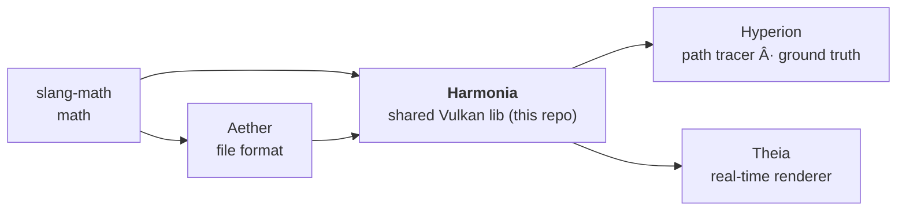

# AGENTS.md — Harmonia

Quick-start context for AI agents so basic facts don't have to be rediscovered each session.

**Outstanding work, governance (definition of done + guardrails) and release history: see
[`PLAN.md`](PLAN.md).**

## What this repo is

**Harmonia** is the shared **Vulkan pipeline library** used 1:1 by both renderers.
It owns the `harmonia::App` host (windowing, swapchain, offscreen capture, arg parsing),
the SPIR-V/Slang shader loading (`compile_slang_shaders`, `createShaderModule`), color-space
utilities, image I/O, tonemapping, the shared `path_integrator.slang` estimator + denoiser
stage, and the `harmonia::IRenderer` interface.

Pipeline (dependency direction):



**Split rule:** code shared 1:1 between renderers goes in Harmonia. Code that diverges
stays renderer-specific (Hyperion = path tracer w/ index buffers + RT; Theia = mesh-shader
rasterizer w/ meshlets). GPU-optimized scene upload / instance / meshlet layouts are
renderer-specific, NOT here.

**Material model = OpenPBR Surface** (Academy Software Foundation). The shared OpenPBR BSDF
(`shaders/bsdf_shared.slang`) — diffuse (Fujii/EON), F82 conductor Fresnel (with the
`F90 = saturate(50·F0)` vanishing-interface fade, Lagarde/Frostbite — no lobe-weight gates),
GGX specular & microfacet transmission BTDF with Turquin/Kulla-Conty multiple-scattering
compensation, LTC sheen, thin-film iridescence (`mx_fresnel_airy`), the coat/fuzz layering
algebra, and the volumetric-medium primitives for the chromatic subsurface / transmission
random walk (`sssExtinction`, `transmissionVolumeCoeffs`, Henyey-Greenstein) — is used 1:1 by
both renderers. Transmission absorption follows **MaterialX tint semantics**: the BTDF is
tinted by `transmission_color` per crossing at `transmission_depth == 0` and is **white**
(untinted) at depth > 0, where the color is realized volumetrically by the walk
(σ_t = −ln(color)/depth) over the actual path length.

**Dielectric sidedness contract (C7):** hit records carry the **raw outward-winding**
geometric normal (`HitInfo.geoNormal` / `GiHit.geoNormal`) — never pre-flipped to face the
ray. Shading flips a local copy by wo; the side bit `dot(wo, geoNormal) < 0` becomes
`SurfaceHit.backface` → the BSDF `exiting` branch (inverted relative IOR: side-correct
Fresnel/Snell + genuine TIR on exit). `geometry_thin_walled` is **exempt**: a thin film has
no bulk interior, so its crossings are side-independent (no eta inversion, never TIR).
Medium walks (Hyperion raygen/miss/closesthit, Theia `runMediumWalk`) apply **exact
deterministic Beer–Lambert transmittance for pure absorbers** (single-scatter albedo = 0 —
ratio-tracking degenerate case, zero walk variance); scattering media use the chromatic
hero-wavelength free-flight estimator. OpenPBR's canonical/reference implementation is **MaterialX** (`mx_*` genGLSL nodes);
follow OpenPBR parameter naming and cross-check against MaterialX. The shared scene-referred
estimator is `shaders/path_integrator.slang`; the shared denoiser (`shaders/denoiser.slang`) is
an à-trous wavelet edge-stopping filter + temporal accumulation — a **presentation stage only**,
forced off for `--output`/`--no-postfx` (fixed pixel radius ⇒ non-converging; see the two-tier
output contract in README).

Hyperion/Theia demos are thin subclasses of `harmonia::App` injecting a `harmonia::IRenderer`.
Shaders load from `*_SHADER_DIR`, never CWD.

## CLI flags (parsed by `harmonia::App::applyCommonArg`)

These work for **both** Hyperion and Theia (Hyperion adds `--spp`, `--depth`):

| Flag | Meaning |
|------|---------|
| `--scene <name>` / `-s` | Scene name (resolves against assets dir) or path. Bare arg also works. |
| `--output <file>` / `-o` | **Headless mode**: render N frames, save EXR (untonemapped) + PNG (tonemapped), exit. |
| `--width <n>` / `--height <n>` | Render resolution. |
| `--validation` / `--no-validation` | Vulkan validation layers. |
| `--no-postfx` | Force off every post-processing stage (A-SVGF denoiser + TAA) — the interactive-window identity that `--output` enforces for offscreen capture. |
| `--indirect-ambient <f>` | Presentation-only indirect ambient boost (scene-referred linear units). |

⚠️ There is **no `--offscreen` flag**. Headless is triggered by `--output` being set.

## Parity comparison tools

`tools/compare_renders.py <reference.exr> <candidate.exr>` computes `mean_diff`, `rel_mse`,
`ssim` (tone-mapped sRGB), luminance-histogram correlation, `psnr`, `mse`, `rel_mean_pct`,
percentile/max diffs and a signed heatmap (`--signed-heatmap`). `tools/check_consistency.py`
covers bias/variance (Theia N vs 4N frames).

Contract (all must hold or the numbers are meaningless):
- Reference = Hyperion EXR; candidate = Theia EXR. **Pre-tonemap linear EXR**, never PNG.
- Same resolution, same working color space (same `[render]` preset).
- Theia's unified accumulation RT path is the only path now.
- **Gate = strict AND across the metric set** (mean_diff ≤ 4.0 in 1/255 units, SSIM ≥ 0.98,
  luminance-histogram corr ≥ 0.999, rel-MSE below tolerance) over the **14 scenes** in
  `tools/validation_manifest.toml` at 320×240 / 256 spp / 256 frames. The
  `compare_renders.py --gate scale-aware` path (absolute OR relative+PSNR) is the sanctioned
  looser gate for HDR transmissive fixtures.
- For IBL references, render Hyperion at high spp (`--spp 256`) — a low-spp reference is
  noisy and inflates `mean_diff`. See Aether/AGENTS.md "low-spp reference trap".

Which metric catches which failure mode, and the bias-vs-noise method: see `PLAN.md`
(*Parity methodology*).

## Build & test

```powershell
cmake -S . -B build -G Ninja -DCMAKE_BUILD_TYPE=Release `
      -DCMAKE_C_COMPILER=clang-cl -DCMAKE_CXX_COMPILER=clang-cl `
      -DCMAKE_TOOLCHAIN_FILE="<vcpkg-root>/scripts/buildsystems/vcpkg.cmake"
cmake --build build
cd build; ctest --output-on-failure
```

Equivalent preset flow (Ninja + Release + clang-cl + `$env:VCPKG_ROOT` toolchain):
`cmake --preset win` / `cmake --build --preset win` / `ctest --preset win`.

**Static analysis:** `python tools/check_tidy.py` — parallel clang-tidy over
`build/compile_commands.json`, classified per `.clang-tidy`'s WarningsAsErrors contract
(clang-diagnostic/clang-analyzer/bugprone fail the run; modernize/performance/portability
are report-only). Also registered as ctest `test_tidy` (label `analysis`; the fast test loop is `ctest -LE analysis`; skips when
clang-tidy, Python3 or the database is missing). Sanitizer lane (Clang/GCC configures only):
`-DHARMONIA_SANITIZER=address|undefined|thread`. Host-side FP is deterministic
(`/fp:strict` / `-ffp-contract=off -fno-fast-math`).

Image I/O uses OpenImageIO (PNG/JPEG/EXR load+save, EXR chromaticities); OpenEXR/stb are
transitive dependencies. The first configure builds OpenImageIO from source (one-time,
several minutes; later configures reuse the vcpkg binary cache).

⚠️ If `cmake --build` fails inside `GoogleTestAddTests.cmake` with a 5 s discovery timeout
on a freshly-linked test exe (cold DLL load / AV scan on its first run), just re-run
`cmake --build build` — gtest discovery passes on retry.

## Conventions

- Commit, but do **not** push unless asked.
- **Logging:** the shared `Logger` prefixes each line with a per-app tag. Applications call
  `Logger::setTag("...")` once at startup (Hyperion → `[HYPERION]`, Theia → `[THEIA]`); the
  Harmonia default is `[HARMONIA]`. Keep the tag uppercase to match the `[INFO]` level style.
- **GPU-driven, latest standard Vulkan, cross-vendor only** (core + `KHR`/`EXT`). No
  vendor-specific extensions (`VK_NV_*`/`VK_AMD_*`/`VK_INTEL_*`) — must run on any vendor.
- Working color space is scene-referred (e.g. `lin_rec2020_scene` / `lin_rec709_scene`).
- SDL3, slangc and volk come from the Vulkan SDK (not vcpkg); vcpkg provides tomlplusplus and OpenImageIO.

## GPU-driven design (Harmonia device layer)

**Principle:** all draw/dispatch submission parameters are GPU-resident and GPU-written.
The CPU records commands only; it never reads back GPU-side state to determine counts or parameters.

**Always-required Vulkan 1.4 features (enabled in Context.cpp):**
- `maintenance4` (Vulkan 1.3), `maintenance5` (Vulkan 1.4) — both required.
- `shaderDemoteToHelperInvocation` (Vulkan 1.3) — required: the C14 `geometry_opacity` cutout
  path uses Slang `discard` (Theia `forward_render.frag.slang`), so the emitted SPIR-V
  declares the `DemoteToHelperInvocation` capability (VUID-08740).
- `rayTracingMaintenance1` + `rayTracingPipelineTraceRaysIndirect2` (`VK_KHR_ray_tracing_maintenance1`) — required; Hyperion dispatches via `vkCmdTraceRaysIndirect2KHR` exclusively.
  `maintenance5` enables `VkBufferUsageFlags2CreateInfo` (64-bit buffer usage flags),
  which is needed by Theia's DGC preprocess buffer (`VK_BUFFER_USAGE_2_PREPROCESS_BUFFER_BIT_EXT`).
- `pushDescriptor` (Vulkan 1.4).
- `hostImageCopy` (Vulkan 1.4) — texture/IBL upload goes host→optimal-tiling image directly via
  `vkCopyMemoryToImage` (no staging buffer, no device copy); see `Texture::create` /
  `IblProbe::uploadEnvPanorama`. Image usage `VK_IMAGE_USAGE_HOST_TRANSFER_BIT`, copy layout `GENERAL`.
- **VMA allocator flag:** `VMA_ALLOCATOR_CREATE_KHR_MAINTENANCE5_BIT` must be set alongside
  `VMA_ALLOCATOR_CREATE_BUFFER_DEVICE_ADDRESS_BIT` to let VMA handle
  `VkBufferUsageFlags2CreateInfo` in `VkBufferCreateInfo::pNext`. When `VK_EXT_pageable_device_local_memory`
  is present, `VMA_ALLOCATOR_CREATE_EXT_MEMORY_PRIORITY_BIT` is also set (driver pages device-local memory
  by priority under VRAM pressure).

**Optional extensions managed here (all follow the same probe→enable pattern):**

| Extension | `DeviceContext` flag | Purpose |
|-----------|---------------------|---------|
| `VK_EXT_mesh_shader` | — (implicit: mesh draws used when enabled) | Mesh/task shaders (Theia rasterizer) |
| `VK_EXT_ray_tracing_invocation_reorder` | `serSupported` | SER reorder hint (Hyperion/Theia RT) |
| `VK_EXT_device_generated_commands` | `dgcSupported` | GPU-generated mesh draw commands (Theia GD6) |
| `VK_EXT_pageable_device_local_memory` (+ its dep `VK_EXT_memory_priority`) | `pageableMemorySupported` | Driver pageable device-local memory; VMA assigns priorities |
| `VK_KHR_calibrated_timestamps` | `calibratedTimestampsSupported` | GPU↔host clock correlation (`vkGetCalibratedTimestampsKHR`); sampled once at startup (see `App::logGpuClockCalibration`) |
| `VK_KHR_present_id` | `presentIdSupported` | Per-present monotonic ID tagging (foundation for present pacing) |
| `VK_KHR_present_wait` | `presentWaitSupported` | `vkWaitForPresentKHR` — CPU-side "frame is on-screen" (`Swapchain::waitForPresent`) |
| `VK_KHR_present_mode_fifo_latest_ready` | `fifoLatestReadySupported` | `VK_PRESENT_MODE_FIFO_LATEST_READY_KHR` — FIFO v-sync, latest-ready image (lower latency) |

**Acceleration structure builds — device-side only (Khronos deprecation compliant):**
- All BLAS/TLAS builds use `vkCmdBuildAccelerationStructuresKHR` (device-side).
- `vkBuildAccelerationStructuresKHR` (host-side) is **never used** — it is deprecated per the
  [Khronos RT AS deprecation blog](https://www.khronos.org/blog/vulkan-ray-tracing-deprecating-host-side-acceleration-structure-builds).
- `VK_KHR_device_address_commands` / `vkCreateAccelerationStructure2KHR` is the **future forward
  path** for AS creation (cleanest device-address-only API). Plan when it becomes available on the
  dev hardware (not yet on RTX 4050 / Vulkan 1.4.341).
