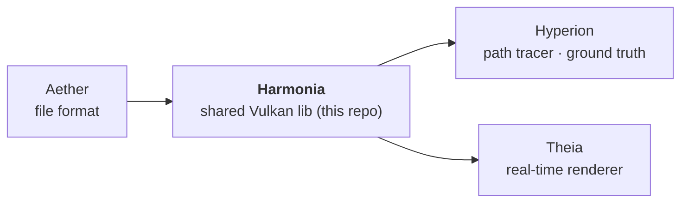

# AGENTS.md — Harmonia

Quick-start context for AI agents so basic facts don't have to be rediscovered each session.

## What this repo is

**Harmonia** is the shared **Vulkan pipeline library** used 1:1 by both renderers.
It owns the `harmonia::App` host (windowing, swapchain, offscreen capture, arg parsing),
the SPIR-V/Slang shader loading (`compile_slang_shaders`, `createShaderModule`), color-space
utilities, image I/O, tonemapping, the shared `path_integrator.slang` estimator + denoiser
stage, and the `harmonia::IRenderer` interface.

Pipeline (dependency direction):



**Split rule:** code shared 1:1 between renderers goes in Harmonia. Code that diverges
stays renderer-specific (Hyperion = path tracer w/ index buffers + RT; Theia = mesh-shader
rasterizer w/ meshlets). GPU-optimized scene upload / instance / meshlet layouts are
renderer-specific, NOT here.

**Material model = OpenPBR Surface** (Academy Software Foundation). The shared OpenPBR BSDF
(`shaders/bsdf_shared.slang`) — diffuse (Fujii/EON), F82 conductor Fresnel, GGX specular &
microfacet transmission BTDF with Turquin/Kulla-Conty multiple-scattering compensation, LTC
sheen, thin-film iridescence (`mx_fresnel_airy`), the coat/fuzz layering algebra, and the
volumetric-medium primitives for the chromatic subsurface / transmission random walk
(`sssExtinction`, `transmissionVolumeCoeffs`, Henyey-Greenstein) — is used 1:1 by both
renderers. OpenPBR's canonical/reference implementation is **MaterialX** (`mx_*` genGLSL nodes);
follow OpenPBR parameter naming and cross-check against MaterialX. The shared scene-referred
estimator is `shaders/path_integrator.slang`; the shared denoiser (`shaders/denoiser.slang`) is
an à-trous wavelet edge-stopping filter + temporal accumulation.

Hyperion/Theia demos are thin subclasses of `harmonia::App` injecting a `harmonia::IRenderer`.
Shaders load from `*_SHADER_DIR`, never CWD.

## CLI flags (parsed by `harmonia::App::applyCommonArg`)

These work for **both** Hyperion and Theia (Hyperion adds `--spp`, `--depth`):

| Flag | Meaning |
|------|---------|
| `--scene <name>` / `-s` | Scene name (resolves against assets dir) or path. Bare arg also works. |
| `--output <file>` / `-o` | **Headless mode**: render N frames, save EXR (untonemapped) + PNG (tonemapped), exit. |
| `--width <n>` / `--height <n>` | Render resolution. |
| `--validation` / `--no-validation` | Vulkan validation layers. |
| `--no-postfx` | Deprecated compatibility flag (`postProcess=false`). Theia legacy postfx path has been removed from runtime. |
| `--rt-gi` / `--no-rt-gi` | Toggle Theia ray-query GI stage (default on). |
| `--indirect-ambient <f>` | **Deprecated** (legacy postfx era; parsed but no longer drives the unified path). |
| `--ssgi-strength <f>` | **Deprecated** (SSGI removed from runtime; parsed for compatibility only). |

⚠️ There is **no `--offscreen` flag**. Headless is triggered by `--output` being set.

## Parity comparison tool

`tools/compare_renders.py <reference.exr> <candidate.exr> [--threshold 4.0] [--heatmap out.png]`

Contract (all must hold or the number is meaningless):
- Reference = Hyperion EXR; candidate = Theia EXR. **Pre-tonemap linear EXR**, never PNG.
- Same resolution, same working color space (same `[render]` preset).
- Theia's unified RT path is the only path now (legacy postfx removed; `--no-postfx` is a no-op).
- Pass = `mean_diff <= 4.0` (in 1/255 luminance units).
- For IBL references, render Hyperion at high spp (`--spp 512`) — a 16 spp reference is
  noisy and inflates `mean_diff`. See Aether/AGENTS.md "16-vs-512 spp trap".

## Build & test

```powershell
cmake -S . -B build -G Ninja -DCMAKE_BUILD_TYPE=Release `
      -DCMAKE_C_COMPILER=clang-cl -DCMAKE_CXX_COMPILER=clang-cl `
      -DCMAKE_TOOLCHAIN_FILE="<vcpkg-root>/scripts/buildsystems/vcpkg.cmake"
cmake --build build
cd build; ctest --output-on-failure
```

Image I/O uses OpenImageIO (PNG/JPEG/EXR load+save, EXR chromaticities); OpenEXR/stb are
transitive dependencies.

## Conventions

- Commit, but do **not** push unless asked.
- **Logging:** the shared `Logger` prefixes each line with a per-app tag. Applications call
  `Logger::setTag("...")` once at startup (Hyperion → `[HYPERION]`, Theia → `[THEIA]`); the
  Harmonia default is `[HARMONIA]`. Keep the tag uppercase to match the `[INFO]` level style.
- **GPU-driven, latest standard Vulkan, cross-vendor only** (core + `KHR`/`EXT`). No
  vendor-specific extensions (`VK_NV_*`/`VK_AMD_*`/`VK_INTEL_*`) — must run on any vendor.
- Working color space is scene-referred (e.g. `lin_rec2020_scene` / `lin_rec709_scene`).
- SDL3, slangc and volk come from the Vulkan SDK (not vcpkg); vcpkg provides openexr, stb.

## GPU-driven design (Harmonia device layer)

**Principle:** all draw/dispatch submission parameters are GPU-resident and GPU-written.
The CPU records commands only; it never reads back GPU-side state to determine counts or parameters.

**Optional extensions managed here (all follow the same probe→enable pattern):**

| Extension | `DeviceContext` flag | Purpose |
|-----------|---------------------|---------|
| `VK_EXT_mesh_shader` | — (implicit: mesh draws used when enabled) | Mesh/task shaders (Theia rasterizer) |
| `VK_EXT_ray_tracing_invocation_reorder` | `serSupported` | SER reorder hint (Hyperion/Theia RT) |
| `VK_KHR_ray_tracing_maintenance1` | `indirectRt2Supported` | `vkCmdTraceRaysIndirect2KHR` (Hyperion) |
| `VK_EXT_device_generated_commands` | `dgcSupported` | GPU-generated mesh draw commands (Theia GD block) |

**Acceleration structure builds — device-side only (Khronos deprecation compliant):**
- All BLAS/TLAS builds use `vkCmdBuildAccelerationStructuresKHR` (device-side).
- `vkBuildAccelerationStructuresKHR` (host-side) is **never used** — it is deprecated per the
  [Khronos RT AS deprecation blog](https://www.khronos.org/blog/vulkan-ray-tracing-deprecating-host-side-acceleration-structure-builds).
- `VK_KHR_device_address_commands` / `vkCreateAccelerationStructure2KHR` is the **future forward
  path** for AS creation (cleanest device-address-only API). Plan when it becomes available on the
  dev hardware (not yet on RTX 4050 / Vulkan 1.4.341).
