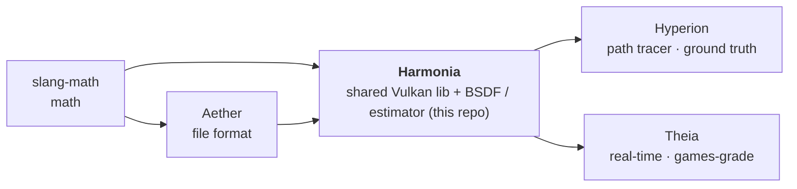

# PLAN — Harmonia

**Living source of truth for outstanding work.** Shipped items are removed from the work
lists; the shipped record is the *Baseline* below and `git log`. Only outstanding work is
tracked here.

**How to read this plan** — *human / PM:* the *Contents* is the index; *How to continue* is
the prioritized next-up list. *AI agent picking up work:* read `AGENTS.md` (orientation,
contracts) → *How to continue* (your task) → *Governance* (definition of done + guardrails)
**before editing any repo**. Harmonia is the family's shared-estimator hub, so this file also
carries the cross-repo research triage, the parity methodology, and the global next-up order.

## Contents

- 1 [Context](#1-context) — what the family is and why
- 2 [At a glance](#2-at-a-glance) — release, last shipped, next
- 3 [How to continue](#3-how-to-continue) — the global prioritized next-up list
- 4 [Quality pillar](#4-quality-pillar) — OpenPBR conformance (C track)
- 5 [Performance pillar](#5-performance-pillar) — PERF · DN · LS/QMC · GI · research triage ·
  parity metrics (PAR) · Vulkan capability adoption (VK/MOD)
- 6 [Feature pillar](#6-feature-pillar) — node hierarchy · animation · bounding volume ·
  slang-math migration slice
- 7 [Parity methodology](#7-parity-methodology) — how Theia is compared against Hyperion
- 8 [Governance](#8-governance) — definition of done + guardrails
- 9 [Baseline](#9-baseline) — release state and shipped history

---

## 1. Context

**OpenPBR Surface 1.1.1** is the single material standard. The family is **two renderers on
three substrates**: slang-math (math), Aether (scene/asset format), and Harmonia (the shared
Vulkan library + the OpenPBR BSDF and path estimator — **this repo**).

- **Hyperion** — offline path tracer, the **unbiased ground truth** (`Hyperion/PLAN.md`).
- **Theia** — real-time path-traced renderer that **converges to Hyperion**, sharing
  Harmonia's OpenPBR BSDF/estimator; the **games-grade tier** (`Theia/PLAN.md`).

**Goal: improve both renderers with the latest algorithms and insights from the industry**
(SIGGRAPH 2025–26 and the surrounding literature). Adopt each technique in the **shared
Harmonia estimator + BSDF** wherever both renderers benefit; per-renderer only where they
genuinely diverge.

| Renderer | API / pipeline | Light transport | OpenPBR | Use case | Parity gate |
|----------|----------------|-----------------|---------|----------|-------------|
| **Hyperion** | Vulkan 1.4 KHR RT pipeline | Unidir. path trace, NEE+MIS, env-CDF, full random walk | Full, unbiased | Offline reference / convergence target | *is* the reference |
| **Theia** | Vulkan 1.4 mesh-shader + RT-GI (`ray_query`) | Accumulation path trace (shared `path_integrator`) + ReSTIR PT (unified reservoir — absorbs DI) + A-SVGF (interactive only; identity in offscreen capture) | Converges to Hyperion | Interactive / real-time / games | convergence gate |

**Parity goal:** Theia converges to Hyperion. The gate is a small **metric set** (§7), not a
single number — PSNR / mean-diff alone is misleading for HDR/scene-referred rendering
(dominated by bright pixels, blind to structure). Cornell scenes PASS (`mean_diff ≤ 4.0`);
the `shaderball_*` eye-parity gaps are closed.

Sibling plans: `slang-math/PLAN.md`, `Aether/PLAN.md`, `Hyperion/PLAN.md`, `Theia/PLAN.md` in
the sibling clones.

---

## 2. At a glance

- **Release:** v0.7.7 — Harmonia / Hyperion / Theia lockstep (Aether v0.7.3; slang-math
  v0.2.1). All five repos verified tag-synced with GitHub (`git ls-remote --tags origin` ==
  `git tag -l`).
- **Last shipped:** v0.7.7 — **C14 / VK2: real OpenPBR `geometry_opacity` cutout** (textured
  `map_opacity` and scalar) as a genuine presence weight, with matching ∏(1-α) shadow
  transmittance and `VK_EXT_opacity_micromap` acceleration — see Baseline.
- **Next:** **GI-SMS** (caustics / SDS chains) — global item #1 below.
- **Newly available (dev driver/SDK upgrade):** the Vulkan 1.4 capability set is verified on
  the dev GPU (RTX 4050, driver 610.88 / SDK 1.4.357) — subgroup rotate/reconvergence,
  `pipeline_binary`, `descriptor_buffer`, present pacing, `cooperative_matrix`,
  `host_image_copy`, `pageable_device_local_memory`, `calibrated_timestamps`. **Adopted:**
  present pacing (VK6), `host_image_copy` (VK8/MOD3), `pageable_device_local_memory` +
  `calibrated_timestamps` (VK10) in v0.7.6; `opacity_micromap` (VK2) in v0.7.7. **Blocked:**
  `descriptor_buffer` (VK7/MOD1 — VMA capture-replay gap). See §5.8.
  (`ray_tracing_position_fetch` was already probed and enabled in `Context.cpp` — not new.)

---

## 3. How to continue

This is the **complete set of `next` items across the family** — every other item in the
track tables is `backlog` / `watchlist` by definition. Work top-down; the order is the
priority. Owner repo in parens; each repo's PLAN.md carries its own slice.

| # | Task | Track | Deps | Status |
|---|------|-------|------|--------|
| 1 | **GI-SMS: Sample Space Partitioning + Spatiotemporal Resampling for Specular Manifold Sampling** (Hong et al., SIGGRAPH Asia 2025) — caustics / SDS chains (reconnection shifts can't handle delta lobes); the real transmission/caustics/TIR fix. *(Harmonia estimator + Theia wire)* | GI | — | **next** |
| 2 | **C9: Bounded VNDF Sampling for Smith-GGX** (HPG 2024) — lower-variance VNDF IS, identical expectation. Prior attempt's pdf did not normalize at grazing → reverted to Heitz 2018; needs a correct derivation. *(Harmonia)* | C | — | **next** |
| 3 | **DN3: Converging Algorithm-Agnostic Denoising** (I3D 2024) — the single tracked replacement for the fixed-radius à-trous filter. Prior attempt was an ad-hoc blend with a magic constant, not the published algorithm → reverted; needs a faithful implementation. *(Harmonia)* | DN | DEN2 ✓ | **next** |
| 4 | **LS2: Neural Product IS via Warp Composition** (SIGA 2024) — env-light × BSDF product sampling; **replaces** Hyperion's env-CDF/NEE in the shared Harmonia estimator (one product-sampling technique), old env-CDF path deleted. *(Harmonia; Hyperion consumes)* | LS | — | **next** |
| 5 | **PERF5: megakernel vs wavefront** (Padilla et al. 2026, arXiv:2605.27323 — **verified**; WPT ~16% faster than megakernel PT) — *kernel-scheduling* decision only; the estimator stays shared in Harmonia. Success criterion is **one shared scheduling architecture for both renderers** unless hard evidence forces two (two path-tracing loop structures = a duplicate implementation). **Gates PERF4.** See the wavefront implementation finding in §5.1. *(Harmonia)* | PERF | — | **next** |
| 6 | **PERF4: ray reordering** (Meister et al. 2025, arXiv:2506.11273 — **verified**) — sorting-key method is kernel-agnostic, but the technique is **wavefront-only** (no ray buffer to sort in a megakernel); 1.3–2.0× trace, though sort overhead is "problematic" on fast RT cores. **Gated by PERF5** — do PERF5 first. *(Harmonia)* | PERF | PERF5 | **next** |
| 7 | **C11: ReSTIR Subsurface Scattering** (I3D 2024) — reservoir resampling *accelerator over the shared random-walk BSSRDF* (same model as ReSTIR PT over the shared `path_integrator`), NOT a second BSSRDF; brings Theia's realtime SSS onto the shared model Hyperion already runs → SSS parity. *(Harmonia + Theia)* | C | — | **next** |
| 8 | **C12: Fully-correlated Anisotropic Micrograin BSDF** (TOG 2024) — the OpenPBR flake/sparkle lobe. *(Harmonia)* | C | — | **next** |
| 9 | **I6: configurable frames-per-flip** (Theia window) — owned by `Theia/PLAN.md`; the flag lands in the shared parser (`src/harmonia/app/CliParser.cpp`). *(Theia)* | I | — | **next** |

> **Editorial rule (v0.7.5):** conformance to OpenPBR 1.1.1 is reached by *implementing
> established algorithms and proven approximations*, not by re-deriving formulas against a
> reference. **"Verify formula X against MaterialX" is not a work item** — that drift surfaces
> in the Theia↔Hyperion alignment workflow. Accordingly **C8, C2, C3 are dropped** (pure
> formula cross-checks; C8 closed as a verified no-op).

The full research landscape — every track's backlog/watchlist with DOIs and the
convergence-to-Hyperion litmus — is in the pillar tables below.

---

## 4. Quality pillar

Physical correctness of the rendered result — conformance to OpenPBR (Hyperion is the ground
truth; OpenPBR's reference impls — Adobe's and MaterialX's — are cross-checks) and
Theia↔Hyperion parity.

### 4.1 Conformance track (C) — OpenPBR 1.1.1 conformance

**C0 closed at v0.6.19:** the full `bsdf_shared.slang` ↔ MaterialX audit is complete — all
lobes Correct/Approx, no hacks or spec contradictions remain. (The shipped surface is **8
lobe weights** in `computeLobeWeights` — diffuse, subsurface, specular, metal, transmission,
coat, fuzz, diffuse-transmission — and **7 discrete sample branches** in `bsdf.slang`.)
Conformance is reached by **implementing established algorithms and proven approximations**
per lobe — not by re-deriving formulas against a reference. MaterialX
(`libraries/bxsd/open_pbr_surface.mtlx`,
`libraries/pbrlib/genglsl/{mx_dielectric_bsdf,mx_generalized_schlick_bsdf,mx_microfacet_specular}.glsl`)
and the OpenPBR Surface paper remain the reference; any formula-level drift surfaces in the
Theia↔Hyperion parity/alignment workflow, so discrete "verify formula X" items are not
tracked.

| ID | Task | Status |
|----|------|--------|
| C9 | **Bounded VNDF Sampling for Smith-GGX** (Tokuyoshi, Eto — HPG/CGIT 2024, [doi:10.1145/3651291](https://doi.org/10.1145/3651291)) — lower-variance VNDF IS, identical expectation. Prior implementation's pdf did not normalize at grazing angles → reverted to Heitz 2018; needs a correct derivation. | **next** |
| C11 | **ReSTIR Subsurface Scattering for Real-Time Path Tracing** (Werner, Schüler, Dachsbacher — I3D/CGIT 2024, [doi:10.1145/3675372](https://doi.org/10.1145/3675372)) — reservoir resampling *accelerator over the shared random-walk BSSRDF* (mirrors ReSTIR PT over the shared `path_integrator`); NOT a second BSSRDF model. Brings Theia's realtime SSS onto the shared model Hyperion already runs → SSS parity by shared substrate, not by a parallel algorithm. | **next** |
| C12 | **Fully-correlated Anisotropic Micrograin BSDF** (Lucas, Ribardière, Pacanowski — TOG 2024, [doi:10.1145/3658224](https://doi.org/10.1145/3658224)) — physically-grounded flake/particle layer; the OpenPBR flake/sparkle lobe. | **next** |
| C4 | Upgrade specular/coat MS compensation (A2 `1/21` / Kulla-Conty) via **Successive Height Preintegration for Smith Microfacet BRDFs** (Zhang et al., SIG 2026 — confirmed published & open-access). **Owns the multi-bounce-Smith slot** as the evolutionary upgrade of the in-engine Kulla-Conty/A2 compensation. | backlog |
| C13 | **Position-Normal Manifold for Glint Rendering** (Wu, Luan, Hasan — SIG 2025, [doi:10.1145/3721238.3730633](https://doi.org/10.1145/3721238.3730633)) — consistent sparkle/glint estimator. | backlog |
| C-W | Watchlist (wave-optics & iridescence / SSS diffusion / inverse capture): *Microfacet Theory for Non-Uniform Heightfields* (d'Eon, SIG'23); *Photon-Beam Diffusion directional SSS* (Liang, TVCG'25); *Wave-optics BSDF for correlated scatterers* (Yang, CGF'25); *Free-Space Diffraction BSDF* (Steinberg, TOG'24); *Thin-film param estimation* (Nakamoto'24); *Practical Inverse Rendering translucent* (Weier, TOG'25). | watchlist |

*Dropped:* **C8** (Smith G₂ "correctness" — a formula re-check; closed as a verified no-op,
the height-correlated Smith term is the proven approximation in use), **C2** (verify σ_t/HG-`g`
mapping vs MaterialX) and **C3** (verify thin-walled ½S(1−g)/½S(1+g) split) — pure formula
cross-checks that belong to the alignment workflow, not the work list. **C10** dropped as the
duplicate-slot loser for multi-bounce Smith — C4 owns the slot (one-technique-per-slot rule,
§5.6). **C14** (`geometry_opacity`) shipped v0.7.7 — see Baseline.

### 4.2 Parity track (M) — Theia converges to Hyperion

_(No outstanding items — the eye-parity / M0 work shipped; Theia↔Hyperion visually aligned.
The gate machinery is §7.)_

---

## 5. Performance pillar

Real-time FPS / interactivity + offline throughput — Theia's games path and Hyperion's
convergence speed. **Industry GI/denoising/perceptual techniques are adopted here.**

### 5.1 Performance track (PERF)

| ID | Task | Status |
|----|------|--------|
| PERF5 | **Megakernel vs Wavefront** GPU path tracing (Padilla, Webster, Kim — 2026, [arXiv:2605.27323](https://arxiv.org/abs/2605.27323); **verified** — 4-page short paper). Reports wavefront path tracing (WPT) ~16% faster than forward megakernel PT, attributed to cache locality (Nsight traces). *Kernel-scheduling* decision only; the estimator stays shared in Harmonia. Target: **one shared scheduling architecture for both renderers** unless hard evidence forces two (two loop structures = a duplicate path-tracing implementation, rejected by the one-slot rule, §5.6). **Gates PERF4** (ray reordering needs a wavefront ray buffer). | **next** |
| PERF4 | **Ray reordering** for faster GPU RT — *On Ray Reordering Techniques…* (Meister, Bokšanský, Guthe, Bittner — 2025, [arXiv:2506.11273](https://arxiv.org/abs/2506.11273); **verified**). The sorting-key method is kernel-agnostic, but the **technique is wavefront-only** — a megakernel traces each ray inline with no ray buffer to sort, so PERF4 cannot ship without PERF5. Yields 1.3–2.0× trace speed; the authors note recovering the sort overhead on fast RT cores is "problematic" (measure on the dev GPU before committing). **Gated by PERF5.** | **next** (post-PERF5) |
| PERF3 | **GPU acceleration-structure pipeline** for Hyperion — owned by `Hyperion/PLAN.md` (AS refit-vs-rebuild + compaction; prerequisite for ANI2). Harmonia slice: `TlasBuilder` currently does full builds only. | backlog |
| PERF6 | **RAFI** multi-node/multi-GPU ray forwarding (Wald, Zellmann et al. — 2026, [arXiv:2605.30294](https://arxiv.org/abs/2605.30294)) — owned by `Hyperion/PLAN.md` (large-scene/streaming scaling). | backlog |
| PERF8 | *Direct Coherent Ray Generation for Path Tracing* (Lou et al. — Visual Computer 2025, [doi:10.1007/s00371-025-04090-6](https://doi.org/10.1007/s00371-025-04090-6)). | watchlist |

**Wavefront (PERF5) implementation finding — the estimator-split prerequisite.** Assessed
2026-08 against the live code (line refs re-verified 2026-09): the shared `integrateSurface`
(`path_integrator.slang:410`) traces **shadow rays synchronously and inline** through the
`ITracer` abstraction at three sites (`:226` sphere NEE, `:329` triangle NEE, `:376` env NEE) —
`tracer.traceTransmittance(...)` returns the shadow transmittance used *in the same call* to
decide the contribution. Wavefront requires
shadow rays to be **asynchronous** (emit → separate trace dispatch → gather), so each NEE
branch must split into an **emit** half (compute `wi`/`tMax`/`Le`/`pdf`/`bsdfVal`/`cosI`/
`fTerm`, write a shadow-ray record + a pending contribution) and a **gather** half (after the
shadow dispatch, commit or discard by the visibility bit). This split must be **identical for
both renderers** (Harmonia split rule), must preserve the exact **RNG sequence** (else
`--deterministic-replay` breaks) and keep **MIS numerically identical** (else the parity gate
breaks). A second phase to split: Hyperion's medium-walk interleaving (`raygen.slang:61–93` —
surface bounces vs free-flight segments as separate budgets in one `while` loop). Theia is
harder — `gi.comp.slang` (~1519 lines) fuses ReSTIR PT + medium walk + path trace.

**Consequence:** PERF5 is a *redesign* of the shared estimator's shadow-ray flow, not a
refactor — and the gate is strict (Hyperion deterministic-replay EXR bit-identical; Theia
14-scene strict-AND parity). It is multi-session, milestone-gated work (M2 split → M2 Hyperion
wire → M3 Theia wire → M4 AABB consumers → M5 PERF4 sort), with **no parallelism across
milestones** (strict chain). Do not begin shader edits that cannot be brought to a verified,
compiling state in the same session — a half-converted estimator leaves both renderers broken.

*Reference material (consult, never a deliverable — not tracked as items):* NVIDIA Vulkan RT
Tutorial v2.0 (nvpro, Vulkan 1.4) for canonical `ray_tracing_pipeline` vs `ray_query`, SBT
layout, AS build/refit and opacity micro-maps.

### 5.2 Denoising & reconstruction track (DN)

**Shipped reality (v0.7.4):** A-SVGF does **not** attenuate to identity at convergence. The
shared à-trous filter has a **fixed pixel radius**, so the structure it destroys depends on
render resolution, not on sample count — a denoised render never converges to the true image.
The parity invariant is therefore held by a **two-tier output contract**, not by the filter:
the denoiser is an interactive presentation stage and is **identity for offscreen capture**
(`--output`), for both renderers (§8 guardrails).

That contract is a workaround for a defective filter, not the end state. The presentation-only
denoiser layer holds **two distinct concerns**, not one:

- **Convergence (DN3).** A provably converging kernel makes the *denoised* image approach the
  true image as samples increase, so the interactive window and the reference stop being two
  different pictures. Fixes the root defect of the fixed-radius à-trous core.
- **Real-time quality at low spp (DN1).** Theia's games-grade window runs at a few samples per
  frame before accumulation resolves it; a neural denoiser recovers plausible detail in that
  regime that a spatial filter cannot. This is a *quality tier for a different operating point*,
  not a fallback to the converging path — both are identity offscreen (v0.7.4), and neither
  stands in for the other.

DN3 lands first (it settles the architecture); DN1 layers on top once the converging core
exists. One direction, sequenced — not two parallel denoiser tracks.

| ID | Paper (venue year, DOI) | Relevance | Litmus | Status |
|----|------------------------|-----------|--------|--------|
| DN3 | **Converging Algorithm-Agnostic Denoising** (Denisova & Bocchi — I3D 2024, [doi:10.1145/3675384](https://doi.org/10.1145/3675384)) | Provably converging, integrator-agnostic — replaces the fixed-radius à-trous core in the shared estimator; parity by construction rather than by stage-disable. | converging | **next** |
| DN1 | **Ragged Neighborhood Attention (RaNAD)** neural denoiser (SIG 2026) — deep-image denoiser for the low-spp interactive window; recovers plausible detail a spatial filter cannot. Presentation-only (identity offscreen per v0.7.4), so it does not touch the parity invariant. Implementation-unblocked by `VK_KHR_cooperative_matrix` (BF16/Float8 compute — VK1): the tensor-class matmul a neural net needs, on-device, no CUDA/TensorRT. | bypassable (presentation) | backlog |
| DN5 | **Generalized Unbiased Reconstruction for Gradient-Domain Rendering** (Yan et al. — TOG 2025, [doi:10.1145/3763297](https://doi.org/10.1145/3763297)) | Unbiased reconstruction; only meaningful if Harmonia adds gradient features (GI-GD, watchlist) — do not start before GI-GD is promoted. | converging | watchlist |

*Dropped:* DN2 and DN4 were further candidates for the **convergence** slot DN3 owns; DN7
(Adaptive Fusion Network) was a direct competitor for the **neural real-time** slot DN1 owns;
DN6 (PatchEX) is TAA-class presentation work with no parity value. One technique per slot.
*Shipped (v0.7.5):* **DEN2** — the two-tier-contract regression test (offscreen capture
bit-identical with the denoiser stage on vs off, both renderers).

### 5.3 Interactivity track (I)

_(No outstanding Harmonia items. The one live interactivity item, **I6** (frames-per-flip),
is owned by `Theia/PLAN.md` — its CLI flag lands in the shared
`src/harmonia/app/CliParser.cpp`. Retired I1–I5 rationale: Theia/PLAN.md Baseline.)_

### 5.4 Sampling track (LS / QMC) — variance reduction for the shared estimator

Beyond ReSTIR (its own track below): many-light importance sampling, product/NEE sampling,
sample-count allocation, and low-discrepancy sequences. All **converging** (consistent
IS/QMC) → safe on the path to Hyperion.

| ID | Paper (venue year, DOI) | Relevance to Theia↔Hyperion | Litmus | Status |
|----|-------------------------|-----------------------------|--------|--------|
| LS2 | **Neural Product IS via Warp Composition** (Litalien, Hašan, Luan, Mullia, Georgiev — SIGA 2024, [doi:10.1145/3680528.3687566](https://doi.org/10.1145/3680528.3687566)) | Normalizing-flow sampler for env-light × BSDF product; beats balance-heuristic NEE — **replaces** Hyperion's env-CDF/NEE in the shared Harmonia estimator (one product-sampling technique); the old env-CDF path is deleted, not carried alongside. | converging | **next** |
| LS1 | **Neural Importance Sampling of Many Lights** (Figueiredo, He, Bako, Kalantari — SIG 2025, [doi:10.1145/3721238.3730754](https://doi.org/10.1145/3721238.3730754)) | Learned per-point light selection for the light-selection slot ReSTIR DI occupies today; only after GI-SMS, since ReSTIR PT owns that slot (§5.5). | converging | backlog |
| SAM1 | **MARS — Multi-sample Allocation via RR & Splitting** (Meyer, Rath, Yazici, Slusallek — SIGA 2024, [doi:10.1145/3680528.3687636](https://doi.org/10.1145/3680528.3687636)) | Fixed-point per-technique sample allocation; optimizes MIS efficiency of the shared integrator. | converging | backlog |
| QMC1 | **SZ Sequences — binary-based (0,2^q)-sequences** (Ahmed, Pharr, Ostromoukhov, Huang — 2025, [arXiv:2505.20434](https://arxiv.org/abs/2505.20434)) | Drop-in Sobol' replacement, bitwise matrices, up to ~1.93× error reduction. Both consistent → only variance changes. **One sequence ships**: measure SZ on our scenes, then either replace Owen-Sobol' outright or close the item — never carry both. | converging | backlog |
| LS4 | **Neural Path Guiding with Distribution Factorization** (Figueiredo, He, Kalantari — EGSR 2025, [arXiv:2506.00839](https://arxiv.org/abs/2506.00839)) | Online neural guiding for *indirect* transport; overlaps GI-PG (§5.5) — pick one before starting. | converging | backlog |

### 5.5 Global illumination track (GI) — ReSTIR ecosystem

Theia's interactive GI runs on the ReSTIR family. Shipped state: **ReSTIR PT** — one unified
reservoir driven by the shared path integrator, which **absorbs DI** (`useRestirDi` is forced
false whenever PT is on, `Theia/src/demo/Application.cpp:460`; the DI candidate path lives
inside the same reservoir, `GiPass.cpp:780`) — plus spatial-only path reuse (see the §8
no-temporal-merge guardrail) and A-SVGF as an interactive-only presentation stage. The
2025–26 ReSTIR wave is tracked here; adopt per the **convergence-to-Hyperion invariant**
(never bias Theia). The SIG 2026 session *"Efficient Sampling: ReSTIR and More"* is the
focal set. The actionable item (GI-SMS) is in *How to continue*; the rest is an adopt/reject
watchlist.

**Overview / onboarding:** the [Wikipedia *Spatiotemporal reservoir resampling* article](https://en.wikipedia.org/wiki/Spatiotemporal_reservoir_resampling)
is a well-sourced entry point — RIS, weighted reservoir sampling, streaming RIS, unbiased
contribution weights, confidence weights (M-cap), backprojection, and shift mappings
(reconnection / half-vector copy / random replay / hybrid). For concept orientation only;
**primary implementation sources remain the papers below** (Bitterli 2020, Lin 2022 GRIS,
Lin/Kettunen/Wyman 2026 Enhanced).

| ID | Paper (venue) | Relevance to Theia | Status |
|----|---------------|--------------------|--------|
| GI-SMS | **Sample Space Partitioning and Spatiotemporal Resampling for Specular Manifold Sampling** (Hong et al., **SIGGRAPH Asia 2025**) | Caustics / SDS chains (reconnection shifts can't handle delta lobes); real caustics/TIR fix. **Owns the caustics slot** — GI-BDPT (TOG 44(5) 2025) targets the same niche and is deliberately not tracked. | **next** |
| GI-PG | **ReSTIR PG** — path guiding w/ spatiotemporally resampled paths (Zeng et al., **SIGGRAPH Asia 2025**) | Hard-to-sample indirect transport; consistent; belongs in the shared estimator. Overlaps LS4 — one guiding approach only. | backlog |
| GI-CG | **Compatibility-Guided Neighbor Selection** (Junkins et al., **HPG 2026, Best Paper**) | Drop-in spatial-reuse quality boost (shift-compatible neighbors) | backlog |
| GI-RS | **Reservoir Splatting** — temporal path resampling + motion blur (Liu et al., **SIGGRAPH 2025**) | Temporal reuse under disocclusion without per-reservoir reprojection | watchlist |
| GI-CV | **Spatio-Temporal Control Variates with ReSTIR for Real-Time Rendering (ReSTCV)** (Shi et al., **SIGGRAPH 2026**) | Variance reduction; consistent **only if** the CV is zero-expectation — audit before adopting | watchlist |
| GI-GD | **Gradient-Domain ReSTIR Path Tracing** (Wang, Kettunen, Lin, Wyman, Wu, Zhao — **CGF 2026**, [doi:10.1111/cgf.70328](https://doi.org/10.1111/cgf.70328)) | Image-space gradient reconstruction over ReSTIR PT (surface paths, consistent → converges); gates DN5 | watchlist |

*Dropped:* **GI-VOL / Ghost ReSTIR** (participating media — out of scope, and a deferred item
is not tracked work), **GI-LOD** (a "line of work" with no citation or actionable content),
**GI-BDPT** (duplicate of the GI-SMS caustics slot).

### 5.6 Research triage — SIGGRAPH / SIGGRAPH Asia / I3D / HPG / EG 2025–26

**Watchlist scope:** we track *any* paper (not just ReSTIR) that advances the two **active**
goals — **quality** (OpenPBR 1.1.1 conformance + Theia↔Hyperion parity) and **speed** (RT /
sampling / denoising throughput) — across all tracks. Anything **out of that box**
(alternative APIs, DSLs/codegen, reference archetypes, lobes beyond OpenPBR 1.1.1) is parked
in **backlog/watchlist**, never "next". Selection criterion is the convergence-to-Hyperion
litmus below; verification uses Semantic Scholar + ACM DL + arXiv/DBLP (never open-index
absence alone).

**Status order:** `next` → `pending` → `backlog` → `watchlist` → `deferred` (lowest). Every
track table is sorted in this order.

**ID gaps:** numbering is not contiguous. Retired IDs mark work that shipped, was folded into
another item, or was dropped as a duplicate slot / out-of-scope: PERF1–PERF2, PERF7, PERF9,
GI1, GI2, GI-BDPT, GI-LOD, GI-VOL, DN2, DN4, DN6, DN7, LS3, PAR6, VK3, VK11, I1–I5, INTEROP1, M0,
C0–C7, R6/R8/R12 (CH1–CH15). Noteworthy retired work is recorded in **Baseline**.

**Phantom-paper audit — corrected:** earlier "phantom" verdicts used only arXiv+DBLP+Wikipedia
absence, which misses SIGGRAPH posters and CGF/proceedings. Re-verified via Semantic Scholar
(broader ACM coverage): **ReSTIR BDPT** ✓ (TOG 44(5) '25), **Ghost ReSTIR** ✓ (SIG '26 poster,
volumetric), **Gradient-Domain ReSTIR PT** ✓ (CGF 2026 → GI-GD). Only **"ReSTIR GO"** remains
unfound by that name (likely a misremembered title). Lesson: never declare a paper phantom
from open-index absence alone.

**Adoption litmus (the convergence-to-Hyperion invariant):** a technique is only acceptable on
the converging path if its contribution → 0 as the sample/frame count → ∞, OR it lives in a
real-time-only layer (denoise, TAA, culling) that is bypassed in reference/accumulation mode.
Any irreducible bias is rejected from the converging path (presentation-only at most).

**One slot, one technique.** Where several papers target the same slot, exactly one is tracked
and the others are dropped — no parallel candidates, no opt-in alternates, no low-end tiers.
A "slot" is an operating regime, not a component: the denoiser layer has two distinct regimes
(convergence vs low-spp real-time quality) and so carries two techniques, DN3 and DN1 — they
do not compete. Current slot assignments: caustics → **GI-SMS** (not GI-BDPT); denoiser
convergence → **DN3** (not DN2 / DN4); denoiser real-time quality → **DN1** (not DN7);
multi-bounce Smith → **C4** (not C10); guiding → **GI-PG** or **LS4**, decide before starting
either; LDS → one of Owen-Sobol' / SZ after measurement (QMC1).

**Conflicts (resolved):**

- *ReSTIR DI vs ReSTIR PT* — mutually exclusive; PT **absorbs** DI into the unified reservoir.
  Don't run both (enforced in code: `useRestirDi = m_useRestirDi && !m_useRestirPt`).
- *Neural GI proxies* (Vertex-Features neural GI, NeLiF, learned light-transport embeddings,
  Gaussian-radiance-field reflections) → **REJECT.** Irreducible bias, diverges from Hyperion.
  Not as a low-end tier, not opt-in, not labelled — rejected outright.
- *Denoiser paradigm* — **the denoiser is a presentation stage and is identity for offscreen
  capture** (shipped v0.7.4; guardrail in §8). A-SVGF is *not* converging — fixed pixel
  radius. The tracked fix is DN3 (converging kernel), gated by DEN2 ✓ (regression test,
  shipped v0.7.5); DEN2's denoiser-on == denoiser-off assertion on captures replaces the old
  "vanish-at-convergence" test.
- *Low-discrepancy sequences* — Owen-scrambled Sobol' is the incumbent; SZ (QMC1) is measured
  and then either replaces it or is closed. The shared library carries exactly one sequence.
- *Cross-vendor re-implementation* — NVIDIA-authored techniques (ReSTIR PG/SMS, neural
  many-light) ship CUDA/TensorRT reference impls; re-target to **Vulkan compute shaders +
  ray_query only** (no NV/AMD/INTEL extensions, no CUDA). Treat their code as algorithm
  reference, never a dependency.

**SIGGRAPH 2026 status** (conference ran 19–23 July 2026): the schedule shows the right
sessions — *Real-Time Rendering*, *Efficient Sampling: ReSTIR and More*, *Reconstruction &
Sampling*, *Light Transport*, *Materials & Textures*, *Shading/Relighting/Volumes* — but
individual paper titles sit behind the schedule app's click-to-expand (not in the overview),
and the conference "Top-10 Fast-Forward" was geometry/differentiable/ML-focused (no GI).
**Re-triage the individual SIG 2026 rendering papers once TOG v45 i4 / ACM Open Access (new
in 2026) is indexable.** The substantive 2026 ReSTIR frontier is already captured: ReSTIR PG +
specular-manifold sampling (GI-SMS, SIGA 2025) and ReSTIR PT Enhanced (I3D 2026).

### 5.7 Parity-metric track (PAR)

**The declared gate is implemented (PAR0, shipped v0.7.5).** `tools/compare_renders.py`
computes `mean_diff`, `rel_mse`, `ssim` (tone-mapped sRGB), luminance-histogram correlation,
`psnr`, `mse`, `rel_mean_pct`, percentile/max diffs and the signed heatmap;
`check_consistency.py` covers bias/variance, and `validation_manifest.toml` gates **14** of
the 30 scenes (strict AND across the metric set). Add new perceptual metrics below as backlog.

| ID | Task | Status |
|----|------|--------|
| PAR2 | **MILO** lightweight perceptual metric for image/latent optimization (Cogalan et al. — TOG/SIG 2025, [doi:10.1145/3763340](https://doi.org/10.1145/3763340)) — cheap full-reference metric to drive Theia-vs-Hyperion loss/tuning. | backlog |
| PAR3 | **CGVQM+D** CG video-quality metric + dataset (Jindal, Sadaka, Thomas, Sochenov, Kaplanyan — CGF/EG 2025, [doi:10.1111/cgf.70221](https://doi.org/10.1111/cgf.70221)) — first CG-specific *video* metric; required by ANI6 (animated parity), so it lands with the animation track. | backlog |
| PAR1 | **tone-map-aware perceptual metric** (SIG 2026, "Adapting Quality Metrics to Tone Mapping") — alongside SSIM/FLIP for the AgX/ACES gate. Owns the tone-mapping-QA slot; PAR6 (Jiang et al., IEEE TMM 2025) was the duplicate candidate and is dropped. | backlog |
| PAR4 | Perceptual-uniformity error metric for HDR colour spaces (Azimi, Kim, Finlayson, Mantiuk — EI/HVEI 2026, [doi:10.2352/ei.2026.38.10.hvei-237](https://doi.org/10.2352/ei.2026.38.10.hvei-237)); complements HDR-FLIP. | backlog |
| PAR5 | **Puzzle Similarity** cross-reference artifact metric (Hermann, Condor, Didyk — ICCV 2025, [doi:10.1109/iccv51701.2025.02682](https://doi.org/10.1109/ICCV51701.2025.02682)) — localizes *where* Theia diverges from Hyperion. | watchlist |

### 5.8 Vulkan capability adoption — newly available on the dev GPU

**Grounding:** verified via `vulkaninfo` on the dev target — **NVIDIA RTX 4050 Laptop, driver
610.88, apiVersion 1.4.341 (SDK 1.4.357)**. All entries are core / `KHR` / `EXT` → compliant
with the cross-vendor guardrail (§8). They follow the established **probe→enable** pattern in
`Context.cpp` (cf. `serSupported` / `dgcSupported` /
`positionFetchSupported` / `meshShaderSupported`): each is *optional* and engaged only when
present — when absent the renderer simply does not use the capability. This is **not** a
fallback: the alternative branch must be image-identical and effectively free, otherwise the
capability becomes a hard requirement and device selection fails fast (§8). Adoption never
biases the image (perf / enabling only) → passes the convergence-to-Hyperion litmus.

*Already adopted, removed from the table:* `VK_KHR_ray_tracing_position_fetch` (formerly VK3)
has been probed and enabled since before this table existed (`Context.cpp`,
`positionFetchSupported`) and underpins the object-space position-fetch guardrail.
`VK_EXT_opacity_micromap` (formerly VK2) shipped v0.7.7 — probed/enabled per-mesh, backing C14
(`geometry_opacity`); the `shaderball_checker` scene demonstrates it. Also adopted (v0.7.6):
**VK10** — `VK_EXT_pageable_device_local_memory` (+ its `VK_EXT_memory_priority` dependency)
for driver-managed VRAM paging, and `VK_KHR_calibrated_timestamps` (GPU↔host clock
correlation, sampled once at startup by `App::logGpuClockCalibration`); **VK8 / MOD3** —
Vulkan-1.4 `hostImageCopy` via `vkCopyMemoryToImage` (host → optimal-tiling image directly;
the staging-buffer upload + `vkCmdCopyBufferToImage` is deleted from `Texture`/`IblProbe`);
**VK6** — `VK_KHR_present_id` + `VK_KHR_present_wait` +
`VK_KHR_present_mode_fifo_latest_ready` (`FIFO_LATEST_READY` present mode, per-present ID
tagging, `Swapchain::waitForPresent`). **VK11** — `shaderDemoteToHelperInvocation` (Vulkan
1.3 core feature) enabled as hard-required in `Context.cpp`: the C14 `geometry_opacity`
cutout's Slang `discard` emits the `DemoteToHelperInvocation` SPIR-V capability, which
tripped VUID-08740 on every `vkCreateShaderModule` until the feature was enabled.
`VK_KHR_swapchain_maintenance1` (the MOD4 scaling
piece) is the one remaining present item — MOD4 is owned by `Theia/PLAN.md`.

| ID | Capability (verified present) | Enables | Track | Status |
|----|------------------------------|---------|-------|--------|
| VK4 | `VK_KHR_shader_subgroup_rotate` + `VK_KHR_shader_maximal_reconvergence` (subgroupSize 32; RT + compute stages) | Warp-coherent reductions/rotations for **ReSTIR reservoir merging & compaction** → faster spatial reuse; maximal reconvergence guarantees a converged wavefront for the path integrator | GI, PERF | backlog |
| VK5 | `VK_KHR_pipeline_binary` | Serialized/faster PSO creation — cuts Theia's cold start (5 pipelines built at init: opaque / transparent / sky / cull / GI) and speeds `.spv` hot-reload | PERF, CH | backlog |
| VK7 | **`VK_EXT_descriptor_buffer`** (EXT — *never* promoted to KHR/core as of SDK 1.4.357) + Vulkan-1.4 `dynamicRenderingLocalRead` (core feature, no extension name) | Modern bindless descriptor path — write descriptor data to a GPU buffer, bind via `vkCmdBindDescriptorBuffersEXT`. **Blocked (see MOD1):** combined-image-sampler descriptors require image capture/replay, whose `VK_MEMORY_ALLOCATE_DEVICE_ADDRESS_CAPTURE_REPLAY_BIT` memory **VMA 3.4 cannot allocate** (no support in `vk_mem_alloc.h`) — a non-VMA sampled-image allocation path is a prerequisite before the conversion can start. | PERF, CH | backlog · **blocked** (→ MOD1) |
| VK1 | `VK_KHR_cooperative_matrix` — coop-matmul in **compute**, **BF16 + Float8** (`shaderBFloat16`/`shaderFloat8CooperativeMatrix`); stages = compute only | Tensor-class matmul in compute shaders, no CUDA/TensorRT — the on-device matmul path **DN1** (the RaNAD neural denoiser) needs. Consumer is DN1; until DN1 starts this stays speculative, so backlog rather than next. | DN | backlog (→ DN1) |
| VK9 | Reduced precision — `shaderFloat16` / `shaderBFloat16` / `shaderFloat8` | FP16/BF16/FP8 compute; consumer is DN1 (with VK1) | DN, PERF | watchlist (→ DN1) |

**Modernization removals — legacy → modern (drop, not just add).** The capability table above
lists what we can *enable*; the "modern Vulkan preferred over legacy" rule (§8) means the
higher-value move is *removing* legacy code now that a verified-present modern equivalent
exists. Each is perf/code-health-only and binding-/sync-/data-equivalent → never biases the
image, passes the convergence-to-Hyperion litmus. Grounded in current code:

| ID  | Legacy (drop) | Modern (use) | Deletes | Track | Status |
|-----|---------------|--------------|---------|-------|--------|
| MOD1 | Descriptor pools/sets — `vkCreateDescriptorPool`/`vkAllocateDescriptorSets`/`vkUpdateDescriptorSets` (5 files, verified: Harmonia `Descriptors` core 1 pool + Theia `ForwardRenderer`/`GiPass`/`GpuCullPass`/`LightCuller` 4 pools) | **`VK_EXT_descriptor_buffer`** (EXT, not KHR) — bindless: write to a GPU buffer, bind via `vkCmdBindDescriptorBuffersEXT` (storage-buffer descriptors = device address; combined-image-sampler descriptors via `vkGetDescriptorEXT` capture/replay) | the `Descriptors` pool abstraction + per-pass pools/allocated sets + all update-writes (keep the 7 passes / 9 call sites already on push descriptors) | PERF, CH | backlog · **blocked** (← VK7): image capture/replay needs `VK_MEMORY_ALLOCATE_DEVICE_ADDRESS_CAPTURE_REPLAY_BIT` memory that **VMA 3.4 cannot allocate** — a sampled-image allocation path outside VMA + the all-or-nothing pipeline-layout flip are prerequisites; needs a dedicated, visually-verified effort |
| MOD2 | `VkFence` — `vkWaitForFences` in Harmonia `Buffer.cpp:321` + `CommandPool.cpp:111` (one-shot submits), and create/wait/reset on Theia's async-compute `m_asyncFences` (`Application.cpp:205/492/495` — the only `vkResetFences` in the tree) | timeline semaphore (core 1.2, no extension) signal/wait — already the only primitive in the frame path (`FrameSync.cpp:22-119`) | every `VkFence` create/wait/reset; unifies sync on one primitive | CH | backlog |
| MOD4 | Full swapchain recreate on resize | `VK_KHR_swapchain_maintenance1` scaling | the recreate-on-resize path | I, PERF | backlog — **owned by `Theia/PLAN.md`** |

*Shipped (v0.7.6):* **MOD3** — Vulkan-1.4 `hostImageCopy`
(`VK_EXT_host_image_copy` promoted to core) replaced the staging-buffer→`vkCmdCopyBufferToImage`
upload in `Texture`/`IblProbe` with `vkCopyMemoryToImage` (host → optimal-tiling image
directly).

**Additive, not a removal (skip):** `VK_EXT_nested_command_buffer` would modernize recording,
but there is no secondary-command-buffer legacy to drop (engine is already primary-only) —
watch only.

**Confirmed still unavailable (future-forward, unchanged):** `VK_KHR_device_address_commands` /
`vkCreateAccelerationStructure2KHR` — the cleanest device-address-only AS-creation API; remains
"plan when available" per the device-layer notes in `AGENTS.md`. Verified **absent** on driver
610.88.

---

## 6. Feature pillar

Capabilities beyond the core estimator — scene structure (node hierarchy), animation, and
bounding-volume consumers. None bias the image — they extend *what* can be represented, not
the estimator. (Aether owns the schema slices — `Aether/PLAN.md`; Theia owns render-loop work
— `Theia/PLAN.md`.)

### 6.1 Node hierarchy track (NH) — Harmonia slice

| ID | Task | Deps | Status |
|----|------|------|--------|
| NH2 | **Shared transform compounding in Harmonia** — `ObjectToWorld` build walks the node tree (one hierarchy consumed by both renderers); replaces flat per-instance matrices. Needs the `sm::trs` builder (slang-math SM4). | NH1 (Aether) | backlog |
| NH3 | **Instanced subtrees** — share a sub-graph across parents (foliage, crowds, debris). | NH2 | backlog |

(NH1 schema + NH4 DCC round-trip: `Aether/PLAN.md`.)

### 6.2 Animation track (ANI) — Harmonia slice

Drive node transforms (later skeleton/morph) over time. Hyperion renders the sequence
offline; Theia updates per frame with motion vectors for temporally-coherent GI/ReSTIR/
denoise.

| ID | Task | Deps | Status |
|----|------|------|--------|
| ANI2 | **Per-frame TLAS refit** — animated, hierarchy-transformed instances refit/rebuilt each frame. Nothing refit-related exists today (full builds only, `TlasBuilder.cpp`), so PERF3 lands the refit-vs-rebuild machinery first. | ANI1, PERF3 | backlog |
| ANI4 | **Skinning (LBS/DQS)** — bone hierarchy + per-vertex bone weights; linear/dual-quaternion blend skinning for articulated characters. Deforms vertices (BLAS-level update, beyond ANI2 TLAS refit). | NH1, ANI2 | backlog |
| ANI5 | **Morph targets / blendshapes** — interpolate between vertex sets (facial animation, shape keys); per-vertex deltas over time (BLAS-level update). | ANI2 | backlog |
| ANI6 | **Animated parity gate** — extend the metric set (§7) to sequences. Needs the still-image gate (PAR0 ✓) and the video metric (PAR3). | PAR0, PAR3, ANI7 | backlog |

(ANI1 schema: `Aether/PLAN.md`. ANI3 object motion vectors: `Theia/PLAN.md`. ANI7 render
sequence to disk: `Hyperion/PLAN.md`.)

### 6.3 Bounding volume track (BV) — Harmonia slice

An authorable per-geometry object-space AABB, generated from OBJ vertex data and consumed by
the renderers for culling and (future) ray rejection. The foundation (BV1 schema in Aether,
BV2 surfacing here, BV3 cull consumer in Theia) shipped; the path-tracing consumer lands with
the wavefront rewrite.

| ID | Task | Deps | Status |
|----|------|------|--------|
| BV4 | **Wavefront ray-gen + NEE consumers** — AABB slab-test cull in the wavefront ray-generation phase (fewer rays to sort/trace) + NEE shadow-ray reject in the shade phase. The data model from BV1–BV3 feeds this directly; no separate AABB buffer needed. | PERF5, BV2 | backlog |

### 6.4 slang-math migration slice

| ID | Task | Deps | Status |
|----|------|------|--------|
| SM6-Harmonia | **slang-math v0.3.0 migration slice** — replace the hand-rolled saturate sites (`src/harmonia/scene/Material.hpp` 12, `SceneOutputCopyPass.cpp` `clamp01()`, `Texture.cpp`, `CliParser.cpp`, `ColorSpace.cpp`, `IblProbe.cpp`), delete the dead `Math::isNanOrInf` (`src/harmonia/utils/Math.hpp:39`) + duplicate `kPi` constants, `IblProbe` hand-rolled `Mat3` → `sm::float3x3` (`IblProbe.cpp:128-160`), per-component trig in `IblProbe.cpp:280-281,327` / `Light.cpp:90-91` → SM2 functions, `Geometry.cpp` TRS → `sm::trs`, test-mirror `rsqrt` cleanup (`tests/unit/test_math.cpp:73`). `verify-full` + pin bump. Track origin: slang-math/PLAN.md SM6. | slang-math v0.3.0 tag | backlog |

---

## 7. Parity methodology

Compare Theia (accumulation) to Hyperion (ground-truth path tracer). Each metric catches a
different failure mode; the gate is **all** of them, never one alone. **All six are
implemented (PAR0 shipped v0.7.5); the manifest gates 14 of the 30 scenes at strict AND.**

| Metric | Catches | Domain | Gate | Implemented |
|--------|---------|--------|------|-------------|
| **mean_diff** (L1) | absolute error budget | scene-referred EXR | ≤ 4.0 (1/255 units) | ✅ `tools/compare_renders.py` |
| **Rel-MSE** | HDR error without firefly / bright-pixel domination | scene-referred EXR | below tol | ✅ `tools/compare_renders.py` (`rel_mse`; plain `mse` + `rel_mean_pct` also kept) |
| **SSIM** | structural / contrast / luminance shifts mean_diff is blind to | tone-mapped sRGB | ≥ 0.98 | ✅ `tools/compare_renders.py` |
| **lum-histogram corr.** | global brightness shift | scene-referred EXR | ≥ 0.999 | ✅ `tools/compare_renders.py` |
| **signed diff + heatmap** | WHERE it differs (brighter/darker, region) | EXR | diagnostic | ✅ `--signed-heatmap` |
| **bias / variance** | biased-wrong vs just-noisy (MC consistency) | Theia N vs 4N frames | diagnostic | ✅ `tools/check_consistency.py` |

**Scope of the gate:** `tools/validation_manifest.toml` runs the automated gate on **14
scenes** at 320×240 / 256 spp / 256 frames — not the full 30-scene gallery. The gate is strict
AND across the metric set (PAR0); the `compare_renders.py --gate scale-aware` (absolute OR
relative+PSNR) path remains the sanctioned looser gate for HDR transmissive fixtures
(`Theia/README.md` gate policy).

**Bias vs noise — the real question.** Theia is a *consistent* estimator of Hyperion iff
Theia@∞frames → Hyperion@∞spp. Method: (1) confirm consistency (Theia N vs 4N diff → 0);
(2) whatever remains at convergence is **bias** — root-caused in code, never tuned away.

**Gold-standard perceptual (optional, heavyweight):** HDR-FLIP (Andersson et al. 2020, HDR
ext. 2021) — JND-based pair metric for HDR; pull in when the cheap set flags disagreement with
the eye. (LPIPS is the neural alternative but needs a model.)

Refs: Wang et al. 2004 (SSIM); Andersson et al. 2020 (FLIP); Huynh-Thu & Ghanbari 2008 (scope
of PSNR).

---

## 8. Governance

### Definition of done

A change is not **done** until the build is warning-clean **and** a representative run is
validation-clean. Both gates are enforced, not aspirational.

**C++ — warning-clean compile.** All repos build under strict warnings-as-errors flags
(`Platform.cmake`: clang-cl `/W4 /WX /permissive- /Zc:__cplusplus`, Clang/GNU
`-Wall -Wextra -Werror -Wpedantic`). A compiler warning **is** a build failure — fix the
cause, never silence it with an opaque cast or `#pragma warning disable`. If a suppression is
genuinely unavoidable, document the reason inline at the pragma and call it out in the
commit. No new warning lands on `main`.

**Vulkan — validation-clean run.** Every run — headless capture (`--output out.exr`) and the
interactive window — runs with validation layers ON and emits **zero** validation errors or
warnings (no VUID messages). A validation message is a bug, never noise: root-cause it
(image-layout transitions, descriptor-pool sizing, pipeline barriers, push-constant layout,
queue-family ownership, …) before moving on. At release time, re-verify across the full
30-scene gallery via `tools/check_vulkan_validation.py` (validation surfaces are
sample-count-independent, so tiny sampling at 320×240 suffices).

**Screenshot gallery standard** (the `screenshots/` PNGs embedded in each renderer README):
1280×720, Hyperion **64 spp** (fireflies acceptable — 256 spp is too slow for the full set),
Theia **256 frames**. **Parity references** are distinct: a clean Hyperion **256 spp** EXR at
the 320×240 parity resolution (never compare against a low-spp reference — the low-spp trap,
Aether/AGENTS.md).

**Definition of done (per change):** `ctest` green in the touched repo(s) **+** a
representative headless render validation-clean **+** the build warning-clean.

**Definition of done (per release):** the above **plus `verify-full`** — the opt-in strict
target present in all five repos (`verify` + format-check + clang-tidy + cppcheck) — **plus**
the parity harness (`tools/render_and_validate.py` over `validation_manifest.toml`) **plus**
`tools/check_vulkan_validation.py` over the 30-scene gallery **plus** regenerated screenshots.

### Guardrails

- **OpenPBR 1.1.1** is the standard; Hyperion is unbiased (no clamps/hacks) **in the
  estimator**. Enforced: the render-path firefly clamp is removed (`raygen.slang:86`), BSDF
  shared 1:1 via Harmonia. Carve-out, stated so "no clamps" is not quietly false: a
  neighbourhood soft-clamp exists in the **display path only** (`shaders/tonemap.slang:289/341`)
  and never touches the scene-referred EXR that parity is measured on.
- **The denoiser is a presentation stage, never part of the estimator (v0.7.4 contract).**
  The A-SVGF stage is forced off for offscreen capture (`--output`) in both renderers
  (`src/harmonia/app/App.cpp:372`); a capture is the raw scene-referred estimator result.
  Reason: the à-trous kernel has a fixed pixel radius, so its effect scales with resolution
  and never vanishes with samples — a denoised image is not a converging image. Do not
  re-enable it on the capture path, and do not describe it as converging. (DEN2 makes this a
  test; DN3 aims to remove the need for the special case.)
- **The path reservoir has NO temporal merge — do not add one back.** Verbatim from
  `Theia/AGENTS.md`: a streamed temporal merge (yesterday's merged reservoir as today's input)
  double-counts re-selected history on heavy-tailed path candidates — measured −2.8% darker on
  cornell indirect @1024f, reproduced in Monte-Carlo simulation; M-caps don't fix it. Spatial
  reuse reads neighbours' **unmerged local** reservoirs (bindings 20/21 store local candidates
  only) — plain unbiased RIS — and progressive accumulation already integrates the temporal
  axis. The DI reservoir's temporal merge carries the same latent bias, invisible on
  light-tailed direct lighting. The only sanctioned route back to temporal memory is the
  unbiased GRIS pairwise-MIS form tracked in `Theia/PLAN.md` (*ReSTIR-PT refinements*).
- **Do not hack to the goal** — root-cause fixes, not tuned thresholds.
- **Fix bugs at once.** A bug found is root-caused and patched in the same session. If an
  immediate fix is genuinely impossible (blocked behind a refactor, upstream change, or
  not-yet-understood cause), log it in the owning repo's PLAN.md with an owner-direction and a
  next action. "Defer" / "track for later" / "document first" are not acceptable resolutions
  for a known defect.
- **Solve directly, never defer.** Every divergence is root-caused and fixed in code. No
  "validation gate", "classify as unrealistic input", or "measure/document first" tracks.
- **Dielectric sidedness contract (C7):** `HitInfo.geoNormal` / `GiHit.geoNormal` is the RAW
  outward-winding normal — never pre-flipped to face the ray. Consumers flip a local copy by
  wo (shading) and read the side bit as `dot(wo, geoNormal) < 0` (backface → BSDF `exiting`
  branch). `geometry_thin_walled` has no bulk interior: its crossings are side-independent
  (no eta inversion, never TIR).
- **Terminator = genuine Chiang 2019 factor.** Defined as `shadowTerminatorFactor` in
  `bsdf_shared.slang:942`; applied in BOTH renderers at every NEE site AND the
  BSDF-continuation throughput (MIS-consistent) — shared sites `path_integrator.slang:221`
  (sphere NEE), `:324` (triangle NEE), `:373` (env NEE), `:486` (continuation); Theia-side
  `gi.comp.slang:899,1017` and `forward_render.frag.slang:302,328`. No origin lift (rejected —
  see the bsdf_shared.slang header). Keep all sites in sync when editing.
- **Position-fetch vertices are OBJECT-space** (`HitTriangleVertexPositionsKHR`, Vulkan spec) —
  always transform by `ObjectToWorld3x4`. Skipping it desyncs the geoNormal on TLAS-rotated
  instances. (`VK_KHR_ray_tracing_position_fetch` is probed and enabled in `Context.cpp`.)
- **Transmission tint follows MaterialX semantics:** the BTDF is tinted by
  `transmission_color` per crossing at `transmission_depth == 0`, and is **white** at
  depth > 0, where the colour is realized volumetrically by the walk (σ_t = −ln(color)/depth)
  over the actual path length.
- **Pure absorbers use exact deterministic Beer–Lambert transmittance** (single-scatter
  albedo = 0 — the degenerate ratio-tracking case, zero walk variance). Do not replace it with
  a stochastic walk.
- **Host-side AS builds are never used** — `vkBuildAccelerationStructuresKHR` is deprecated
  per Khronos; device builds only (see `AGENTS.md`).
- **Required Vulkan 1.4 feature floor** (hard requirements, not optional probes):
  `maintenance4` (1.3), `maintenance5` + `pushDescriptor` (1.4), `synchronization2`,
  `dynamicRendering`, descriptor indexing, `bufferDeviceAddress`, `timelineSemaphore`,
  `rayQuery` + `rayTracingPipeline` + `accelerationStructure`. VMA must be created with
  `VMA_ALLOCATOR_CREATE_KHR_MAINTENANCE5_BIT` alongside
  `VMA_ALLOCATOR_CREATE_BUFFER_DEVICE_ADDRESS_BIT`.
- **FetchContent asset trap** — editing the Aether working tree's `assets/*.toml` has **no
  effect** on a render: the build consumes the FetchContent copy of Aether pinned by
  `GIT_TAG`. Symptom: two "different" renders give byte-identical metrics. Either commit+tag
  Aether and bump the pin, or configure with
  `-DFETCHCONTENT_SOURCE_DIR_AETHER=<path-to-aether>`. Same pattern for slang-math and
  Harmonia. (Canonical wording: Aether/AGENTS.md.)
- **Vulkan policy: latest + KHR/EXT, modern over legacy, no fallbacks.** Hyperion and Theia
  target the **latest stable Vulkan** (currently 1.4) and bump as new core versions ship.
  Prefer **core features + KHR/EXT extensions** over vendor (NV/AMD/INTEL) extensions wherever
  a portable path exists, and prefer **modern extensions over superseded/legacy ones**
  (`VK_KHR_ray_tracing_pipeline`, not `VK_NV_ray_tracing`; `VK_KHR_dynamic_rendering` and
  `VK_KHR_synchronization2`, not legacy render-pass and semaphore/barrier APIs; core /
  `VK_EXT_mesh_shader`, not `VK_NV_mesh_shader`; `VK_KHR_buffer_device_address`, not
  `VK_EXT_buffer_device_address` / `VK_NV_buffer_device_address`). **No fallback paths** — if
  a required feature is missing at device selection, fail fast rather than maintain a second
  code path. An *optional* capability is permitted only when its absent-branch is
  image-identical and free to maintain (the §5.8 probe→enable pattern); anything that produces
  a different image, or duplicates a code path to stay alive, is a fallback and is removed.
  The same rule applies to this plan itself — no "opt-in alternative", no "low-end tier", no
  two candidate techniques carried for one slot.
- Commit per-repo; push only on explicit OK.
- **Tags are always pushed to GitHub.** When a release is tagged, the tag (and the
  commit/branch it rides on) is pushed so GitHub reflects the true released state. After any
  local tag, verify `git ls-remote --tags origin` matches `git tag -l` for every repo. Release
  order follows the dependency direction: slang-math → Aether → Harmonia → Theia / Hyperion;
  each downstream repo's `FetchContent` `GIT_TAG` pin is bumped to the freshly tagged upstream
  version in its own release commit.
- Build: clang-cl + Ninja + vcvars; slangc `.slang`→`.spv`; force-recompile `.spv` when shared
  Harmonia shaders change (CMake does not track Slang import chains — touch the consuming
  entry shaders; new Theia compute entries → `THEIA_ENTRY_SHADERS`).
- `mul(M, v)` column-vector; `-matrix-layout-row-major` in every slangc invocation.
- **Living document — done work is removed.** Shipped/resolved items are deleted from this
  plan, never marked "done" and left behind; the shipped record lives in the Baseline and
  `git log`. When the last item in a track ships, collapse it to a one-line "no outstanding
  items" note.

---

## 9. Baseline

- **Tagged on GitHub:** slang-math @ **v0.2.1**; Aether @ **v0.7.3**; Harmonia / Hyperion /
  Theia @ **v0.7.7**. Verified: `git ls-remote --tags origin` == `git tag -l` in all five
  repos, and the `FetchContent` pins resolve (Hyperion/Theia → Harmonia v0.7.7 → Aether
  v0.7.3 → slang-math v0.2.1).
- **v0.7.7** (current; slang-math unchanged, Aether bumped to v0.7.3): **C14 / VK2 — real
  OpenPBR `geometry_opacity` cutout**, closing the only non-conformant row in the OpenPBR
  table (§4.1). `geometry_opacity` (scalar and textured via the new `map_opacity` material
  input) is now the spec's actual presence weight `mix(S_ambient-medium, M_surface, α)`
  (§Opacity/Transparency), not a BRDF-weight approximation. **Harmonia's slice:**
  `VK_EXT_opacity_micromap` probed/enabled (`opacityMicromapSupported`,
  `Context.cpp`/`PhysicalDevice.cpp`); `MicromapBuilder` (device-side
  `vkCmdBuildMicromapsEXT`, matching the AS-build device-only rule); `TriangleMesh::buildBlas`
  chains a built micromap via `VkAccelerationStructureTrianglesOpacityMicromapEXT` and — new —
  drops `VK_GEOMETRY_OPAQUE_BIT_KHR` on any mesh a cutout material can reach
  (`MeshOpacity::alphaTested`), which is what lets the shadow path see the cutout at all.
  `bsdf_shared`'s `ITracer::traceOccluded` (bool) became `traceTransmittance` (float) —
  shadow visibility is now the OpenPBR ∏(1-α) product (the spec's "transparent shadows"
  form), not a binary hit/miss. The stochastic opacity pass-through
  (`path_integrator.slang`) no longer charges the surface-bounce budget
  (`PathState::passedThrough`, a null interaction exactly like a medium free-flight segment)
  and resumes the ray with a new `kNullInteractionEpsilon` instead of the scattering
  `kRayEpsilon` — reusing the larger epsilon was silently stepping the resumed ray through
  coincident geometry (a cut-out object resting on a floor rendered the floor-contact patch
  black; root-caused via a per-hit identity probe, not tuned away). Aether/Hyperion/Theia
  slices in their PLAN.md baselines. Verified: `verify-full` clean in all four touched repos;
  ctest green (Aether 42, Harmonia 88, Hyperion 42, Theia 17); validation-clean headless
  (28/28 manifest runs + `shaderball_checker`/`shaderball_opacity`/`shader_ball` ad hoc);
  `shaderball_checker` PASS (strict AND) for with- vs without-extension in both renderers —
  the acceleration is provably image-identical to the unaccelerated cutout; 30×2 screenshot
  gallery regenerated.
- **v0.7.6** (Harmonia-only; both renderers consume it live): **Vulkan capability adoption.**
  VK10 (`VK_EXT_pageable_device_local_memory` + `VK_EXT_memory_priority`; VMA
  `EXT_MEMORY_PRIORITY` flag; `VK_KHR_calibrated_timestamps` via `App::logGpuClockCalibration`),
  VK8/MOD3 (`hostImageCopy` via `vkCopyMemoryToImage`; staging-buffer upload deleted from
  `Texture`/`IblProbe`), VK6 (`VK_KHR_present_id`/`present_wait`/`present_mode_fifo_latest_ready`;
  `Swapchain::waitForPresent`). All probe→enable except `hostImageCopy` (hard Vulkan-1.4
  requirement, MOD3 = removal). Verified: warning-clean, `verify-full` clean, ctest 83/83,
  validation-clean headless + windowed, EXR-stats pixel-confirmed, 29×2 gallery regenerated
  (Hyperion byte-identical). **VK7/MOD1 deferred** — VMA 3.4 cannot allocate capture-replay
  memory. Drive-by: `GpuTypes.hpp:87` clang-format fix.
- **v0.7.5**: **PAR0** — a real parity gate (Rel-MSE/SSIM/luminance-histogram, strict AND,
  manifest 3→14 scenes); **B4** emissive analytic-sphere NEE (Hyperion); **B5** `--no-postfx`
  real + unknown-arg hard-error; **FB1–FB3** — the three forbidden fallback paths removed;
  **DEN2** denoiser two-tier-contract regression test. **C8** closed as a documented no-op.
  **C9** and **DN3** attempted and **reverted** (unfaithful to the published algorithms);
  restored to Heitz-2018 VNDF and established A-SVGF. `verify-full` / ctest (142) /
  Vulkan-validation (58/58) clean.
- **v0.7.4**: **two-tier denoiser output contract** — A-SVGF forced off when `--output` is
  set, both renderers (`src/harmonia/app/App.cpp:372`). Root cause: the shared à-trous
  filter's fixed pixel radius makes denoised output resolution-dependent and non-converging
  (Hyperion 320×240 vs its own 4× supersample: 13.7/255, spp-independent), and it was applied
  asymmetrically between renderers → 12–21/255 parity error on env-lit regions.
- **v0.7.3**: code-health refactoring — **R6** RAII Vulkan handle wrappers
  (`harmonia::UniqueHandle`, 18 owning classes + App semaphores); **R8** Extract Class (Theia
  Application/ForwardRenderer; Harmonia App: CliParser/AppConfig, OffscreenCapture,
  FrameSync); **R12** namespace consistency (all Harmonia types in `harmonia::`).
  `verify-full` clean; no rendering behavior change.
- **v0.7.2** (slang-math bumped to v0.2.1): Extract Function on all god methods across the
  family (recordFrame 780L, SceneOutputCopyPass::record 720L, createPipeline 567L,
  IblProbe::loadFromEXR 360L, buildSceneBuffers 465L, …); Scene→SceneBase Template Method;
  setDebugName templatization; submitOneShot/makeSampler/createFence shared helpers; magic
  numbers → named constants; dead code removal; latent bug fixes (stoi→from_chars, range
  clamps, sizeof push-constant, ignored VkResults). No rendering behavior change.
- **v0.7.1**: GI2 full PT (Theia multi-bounce path reservoir; no temporal merge by design);
  GI2.7 M-aware denoising + `check_consistency.py` variance-⊘-1/N harness (Harmonia).
- **Earlier releases (v0.6.19 → v0.7.0):** OpenPBR conformance **C0–C7** (the full
  `bsdf_shared.slang` ↔ MaterialX audit); the Harmonia substrate single-sourcing (SYN1); OBJ
  tooling + camera/doc/license cleanup (SYN2); the `check_vulkan_validation.py` gate. Detail
  in `git log`.
- Permanent invariants from this work live in **Guardrails** (§8).
- **INTEROP note:** ANARI (INTEROP1) and CrossRT codegen (PERF9) were permanently deferred —
  a second rendering API is the largest fallback of all. Re-open deliberately with a concrete
  consumer if external interop ever becomes a goal.
