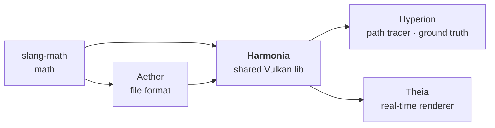

# Harmonia

The shared Vulkan foundation for the [Hyperion](https://github.com/McNopper/Hyperion)
(offline) and [Theia](https://github.com/McNopper/Theia) (real-time) renderers —
everything common **except** the renderer itself and the [Aether](https://github.com/McNopper/Aether)
file format.

> *[Harmonia](https://en.wikipedia.org/wiki/Harmonia) — Greek goddess of harmony and
> concord, who reconciles opposing forces into a unified whole.* Harmonia **unifies** the
> two renderers on one foundation: Vulkan core, GPU scene upload, color management,
> tonemapping, SDR/HDR presentation.



---

## Scope

- **Application host** — `harmonia::App`: window, swapchain, HDR render target,
  tonemap + present loop, IBL probe wiring, scene loading and offscreen (headless)
  rendering; renderers plug in via the `harmonia::IRenderer` interface
- **Vulkan core** — device/context (incl. optional ray-tracing and `VK_EXT_mesh_shader`
  when supported), buffers, images, command pools, queues, barriers, logging, timers
- **Shared GPU types** — `GpuVertex`, `GpuMaterial`, `GpuLight`, `GpuEmissiveTriangle`,
  `CameraData`, `PushConstants` and the `Tonemapper` / `LightType` enums
- **GPU upload primitives** — buffers, bindless textures, images (with mip support),
  procedural geometry, IBL probe precompute
- **Color management** — selectable linear Rec.2020 (default) or Rec.709 working color
  space, color-space conversions on asset load
- **Tonemapping** — AgX, ACES, Reinhard, Hable
- **Presentation** — swapchain, surface, SDR / HDR10 / scRGB output color spaces
- **Shared render utilities** — camera, descriptors, pipeline, acceleration structure
- **Shader toolchain** — the `compile_slang_shaders` CMake rule (Slang → SPIR-V at build
  time, used identically by Harmonia, Hyperion and Theia) and the shared SPIR-V loader
  (`harmonia::createShaderModule`)
- **Shared Slang modules** — `bsdf_shared.slang` (the full OpenPBR Surface BSDF — see
  *Material model* below), `env_sample.slang` (pure-parameter CDF
  env-map importance sampling), `path_integrator.slang` (renderer-agnostic unidirectional
  path-integrator surface estimator — emissive/env NEE + MIS + Russian roulette, shared
  1:1 between Hyperion's path tracer and Theia's RT-GI compute stage via an `ITracer`
  abstraction), `math.slang` (sampling, RNG, GGX helpers), `env.slang`
  (env-map wrappers); renderers import these via `-I ${HARMONIA_SHADER_SOURCE_DIR}` and
  add renderer-specific code on top — no shader duplication between Hyperion and Theia
- **Image I/O** — PNG/JPEG load ([OpenImageIO](https://openimageio.readthedocs.io/)),
  EXR load/save with chromaticities (OpenImageIO, OpenEXR transitively); textures and
  IBL probes are colour-space-converted on load. Offscreen capture writes a scene-referred
  EXR plus a tone-mapped sRGB PNG produced by running the **same GPU ToneMapper stage as the
  interactive window** (`App::tonemapToCaptureImage` → `ImageCapture::saveSdrPng`), so
  screenshots match the live view regardless of the window's negotiated HDR/SDR swapchain

It does **not** contain a renderer or a renderer's GPU scene. Hyperion provides the
offline path tracer, Theia the real-time forward renderer; both demos are thin
subclasses of `harmonia::App` that inject their renderer through `harmonia::IRenderer`,
and **each renderer owns its own `Scene` and `GpuInstance` layout** — Hyperion's is built
around index buffers and a ray-tracing pipeline, Theia's around meshlets and mesh shaders.
Only types and code that are shared **1:1** live here; anything that diverges per renderer
stays in the renderer.

---

## Material model — OpenPBR Surface v1.1.1

The shared `shaders/bsdf_shared.slang` implements the full OpenPBR 1.1.1 layer stack,
used 1:1 by both renderers — this section is the canonical description (the renderer
READMEs link here).

Conductor reflectance uses the OpenPBR generalized-Schlick **F82-tint** model
(`base_color` = F0, `specular_color` = the 82° tint); specular/coat microfacets use GGX
with the spec's anisotropy remapping plus Turquin/Kulla-Conty multiple-scattering energy
compensation on both the reflection **and** the rough-transmission lobes (so rough glass
does not lose energy). The F82 conductor Fresnel carries the
`F90 = saturate(50·F0)` vanishing-interface fade (Lagarde/Frostbite — no lobe-weight gates).

**Layer stacking** follows OpenPBR's directional-albedo coupling rather than a linear
blend: each lower layer is attenuated by the directional albedo of the layer above it
(`R_out = R_top + (1 − E_top)·R_base`). The coat darkens the substrate by
`1 − coat·E_coat` and the dielectric diffuse/subsurface base sits under the specular
layer (`1 − E_spec`); both are applied symmetrically in view/light so the stack stays
reciprocal and energy-conserving.

**Thin-film iridescence** is the spec model — a faithful port of MaterialX
`mx_fresnel_airy` (Belcour & Barla 2017): a full s/p-polarized Airy summation with the
spectral Gaussian sensitivity. For metals it uses the true **complex-IOR conductor
phase** (with `(n,k)` recovered from `base_color` + `specular_color` via the Gulbrandsen
2014 artist-friendly mapping), so anodized metals show vivid, physically-correct
interference colour; dielectric bases use the Schlick interface, and the two are blended
by `base_metalness`.

**Fuzz/sheen** is the OpenPBR spec model — a faithful port of MaterialX's Zeltner et al.
2022 "Practical Multiple-Scattering Sheen Using Linearly Transformed Cosines". The LTC
coefficients and the sheen directional albedo are closed-form analytic fits (no lookup
table), and that directional albedo also drives the physically-correct, view-dependent
darkening of the layers beneath the fuzz.

**Subsurface** (bulk, non-thin-walled) is a **real volumetric random walk**, not a
diffusion or tinted-diffuse approximation: light refracts through the dielectric
interface (Fresnel-gated), takes an exponential free-flight walk with Henyey-Greenstein
phase scattering (`subsurface_scatter_anisotropy` = the phase mean cosine), and exits
through the interface with Fresnel-gated transmission / total internal reflection.
Extinction is **chromatic (per-channel)** — derived from `subsurface_radius` ×
`subsurface_radius_scale`, so the default `(1, 0.5, 0.25)` scale gives the characteristic
red-shifted subsurface glow; the single-scatter albedo is `subsurface_color`. A
**hero-wavelength spectral-MIS estimator** samples one channel's mean-free-path per step
and reweights the others, and reduces exactly to the achromatic walk when the extinction
is grey (clear glass stays byte-stable). The walk runs on its own bounce budget (it does
not starve surface transport). Thin-walled subsurface keeps a diffuse
reflection/transmission sheet.

**Transmission scattering** reuses the same volumetric walk: when `transmission_scatter`
is set, the smooth dielectric interior becomes a genuine scattering medium (milky/cloudy
liquids) rather than a fixed tint, while `transmission_color` / `transmission_depth`
provide the Beer–Lambert absorption. For pure absorbers (`transmission_scatter = 0`) the
walk applies **exact deterministic per-channel Beer–Lambert transmittance** at the
boundary (ratio-tracking degenerate case — zero walk variance), and dielectric exits are
**side-correct**: interior rays refract with the inverted IOR and undergo genuine total
internal reflection, matching the MaterialX `dielectric_bsdf` / PBRT-v4 `DielectricBxDF`
convention.

**Diffuse** is the Fujii/EON model; **dielectric sidedness** follows the raw-outward-normal
contract (see `AGENTS.md`).

---

## Building

**Requirements:** Vulkan SDK 1.4, CMake 3.28+, Ninja, clang-cl, vcpkg.

```bash
cmake -S . -B build -G Ninja \
      -DCMAKE_BUILD_TYPE=Release \
      -DCMAKE_C_COMPILER=clang-cl \
      -DCMAKE_CXX_COMPILER=clang-cl \
      -DCMAKE_TOOLCHAIN_FILE="<vcpkg-root>/scripts/buildsystems/vcpkg.cmake"

cmake --build build
```

## Tests

```bash
cd build && ctest --output-on-failure
```

## Validation harness

Batch-compare Hyperion references against Theia candidates with:

```bash
python tools/validate_renders.py <reference_dir> <candidate_dir>
```

The gated scene set lives in `tools/validation_manifest.toml` — **14 scenes**
(the Cornell set, `dragon_teapot`, and the `shaderball_*` / `openpbr_*` material fixtures),
compared at 320×240 / 256 spp / 256 frames with a **strict-AND metric set** (mean_diff,
rel_mse, SSIM, luminance-histogram correlation). Use `--scale-aware` for HDR/transmissive
scenes that need the relaxed gate from `compare_renders.py`.

To render and compare a whole batch in one go:

```bash
python tools/render_and_validate.py <hyperion.exe> <theia.exe> <output_root>
```

## Shared denoiser stage

The scene pipeline includes a shared **A-SVGF** denoiser stage before tone mapping (when
`stages.denoiser` is enabled): an à-trous wavelet edge-stopping filter with temporal
accumulation and an adaptive per-pixel gradient that reprojects history via motion vectors
(so camera motion does not reset the temporal history). It filters accumulated HDR with
guide buffers (`gNormal`/`gDepth`) and blends history in fixed-view mode.

**Two-tier output contract (presentation vs reference).** The à-trous kernel has a **fixed
pixel radius**, so the structure it destroys scales with render resolution and does **not**
vanish as samples increase — a denoised image is therefore **not** a converging image. The
denoiser is an **interactive presentation stage only**: it is forced off for offscreen capture
(`--output`) and with `--no-postfx`, in **both** renderers (`App.cpp`), so a capture is always
the raw scene-referred estimator result that parity is measured against. Convergence to the
reference comes from accumulation alone, not from the filter. Theia extends the same capture
purity to its remaining presentation aids: the firefly clamps and the A3(a) secondary-bounce
roughness regularization switch off for `--output`, and camera jitter is forced on — the
capture integrates the same pixel footprint as Hyperion's per-sample jitter and converges to
the unclamped ground truth.

Runtime tuning flags:

- `--denoiser-strength <0..1>` spatial filter strength (default `0.45`)
- `--denoiser-iterations <1..8>` spatial passes (default `2`)
- `--denoiser-history-blend <0..1>` temporal blend amount (default `0.15`)
- `--denoiser-no-history` / `--denoiser-history` disable/enable temporal blend
- `--denoiser-no-gradient` / `--denoiser-gradient` disable/enable the A-SVGF adaptive gradient
- `--denoiser-gradient-alpha <0..1>` temporal blend for the gradient (default `0.2`)

## Consuming Harmonia

Hyperion and Theia pull Harmonia (and, transitively, Aether) via CMake `FetchContent`
and link the `harmonia::harmonia` target.

---

## Dependencies

| Library | Purpose |
|---------|---------|
| [Aether](https://github.com/McNopper/Aether) | Scene & material file formats (`.scene.toml` / `.materials.toml` / OBJ) — GPU-agnostic CPU data |
| [Vulkan SDK](https://vulkan.lunarg.com/) | Vulkan 1.4 API, Slang compiler (`slangc`), SDL3, volk |
| [VMA](https://github.com/GPUOpen-LibrariesAndSDKs/VulkanMemoryAllocator) | GPU memory allocation |
| [slang-math](https://github.com/McNopper/slang-math) | Mathematics — vector/quaternion/matrix types; header-only, via FetchContent |
| [OpenImageIO](https://openimageio.readthedocs.io/) | Image I/O — PNG/JPEG/EXR load and save; EXR chromaticities for working color-space metadata |
| [Slang](https://shader-slang.com/) | Shader language (Slang → SPIR-V); shared modules compiled via `compile_slang_shaders` |
| [Google Test](https://github.com/google/googletest) | Testing |

---

## References

The specifications, standards, and papers the shared `bsdf_shared.slang`, `path_integrator.slang`,
color management, and tonemapping stages are based on:

### Material model — OpenPBR Surface
| Resource | Relevance |
|----------|-----------|
| [OpenPBR Surface Specification v1.1.1](https://academysoftwarefoundation.github.io/OpenPBR/) | Authoritative layer stack, parameter names, and closure algebra — the ground-truth `bsdf_shared.slang` targets |
| [MaterialX `open_pbr_surface` / `mx_fresnel_airy`](https://github.com/AcademySoftwareFoundation/MaterialX) | Reference node graph and shader implementations; `mx_*` function/parameter naming is used verbatim (no aliasing) |

### Surface BSDF closures
| Resource | Relevance |
|----------|-----------|
| [Walter, Marschner, Li & Torrance — "Microfacet Models for Refraction through Rough Surfaces" (EGSR 2007)](https://www.cs.cornell.edu/~srm/publications/EGSR07-btdf.pdf) | GGX (Trowbridge-Reitz) NDF and Smith G; foundation of the specular/coat/transmission microfacet lobes |
| [Heitz — "Understanding the Masking-Shadowing Function in Microfacet-Based BRDFs" (JCGT 2014)](https://jcgt.org/published/0003/02/03/) | Height-correlated Smith G2 masking-shadowing used in the GGX lobes |
| [Heitz — "Sampling the GGX Distribution of Visible Normals" (JCGT 2018)](https://jcgt.org/published/0007/04/01/) | VNDF importance sampling for specular/coat microfacets |
| [Kulla & Conty — "Revisiting Physically Based Shading at Imageworks" (SIGGRAPH 2017)](https://blog.selfshadow.com/publications/s2017-shading-course/imageworks/s2017_pbs_imageworks_slides.pdf) | Multiple-scattering energy compensation and directional-albedo layering |
| [Turquin — "Practical Multiple Scattering Compensation for Microfacet Models" (2019)](https://blog.selfshadow.com/publications/turquin/ms_comp_final.pdf) | GGX multiple-scattering (Turquin/Kulla-Conty) compensation term |
| [Gulbrandsen — "Artist Friendly Metallic Fresnel" (JCGT 2014)](https://jcgt.org/published/0003/04/03/) | Recovering complex IOR `(n,k)` from `base_color` + `specular_color` for the F82 / thin-film conductor phase |
| [Belcour & Barla — "A Practical Extension to Microfacet Theory for the Modeling of Varying Iridescence" (SIGGRAPH 2017)](https://belcour.github.io/blog/research/publication/2017/05/01/brdf-thin-film.html) | Airy-summation thin-film iridescence (`mx_fresnel_airy`) |
| [Zeltner, Burley & Chiang — "Practical Multiple-Scattering Sheen Using Linearly Transformed Cosines" (SIGGRAPH 2022)](https://tizianzeltner.com/projects/Zeltner2022Practical/) | Analytic LTC fuzz/sheen and its directional-albedo layer darkening |
| [Heitz, Dupuy, Hill & Neubelt — "Real-Time Polygonal-Light Shading with Linearly Transformed Cosines" (SIGGRAPH 2016)](https://eheitzresearch.wordpress.com/415-2/) | Linearly Transformed Cosines foundation for the sheen closure |

### Volumetric & spectral transport
| Resource | Relevance |
|----------|-----------|
| [Henyey & Greenstein — "Diffuse Radiation in the Galaxy" (1941)](https://articles.adsabs.harvard.edu/pdf/1941ApJ....93...70H) | Henyey-Greenstein phase function for the subsurface / transmission random walk |
| [Wilkie, Nawaz, Droske, Weidlich & Hanika — "Hero Wavelength Spectral Sampling" (EGSR 2014)](https://cgg.mff.cuni.cz/publications/hero-wavelength-spectral-sampling/) | Hero-wavelength spectral-MIS estimator used for chromatic (per-channel) subsurface / transmission media |
| [Novák, Georgiev, Hanika & Jarosz — "Monte Carlo Methods for Volumetric Light Transport Simulation" (Eurographics STAR 2018)](https://cs.dartmouth.edu/~wjarosz/publications/novak18monte.html) | Free-flight distance sampling, collision estimators, and transmittance for the medium walk |

### Light transport
| Resource | Relevance |
|----------|-----------|
| [Physically Based Rendering: From Theory To Implementation, 4th ed.](https://www.pbrt.org/) (Pharr, Jakob, Humphreys) | Path-integrator estimator, BSDF sampling, MIS, area-light NEE, environment importance sampling |
| [Veach — "Robust Monte Carlo Methods for Light Transport Simulation" (1997)](http://graphics.stanford.edu/papers/veach_thesis/) | Multiple Importance Sampling (balance heuristic) used in `path_integrator.slang` |
| [Hanika — "Hacking the Shadow Terminator" (Ray Tracing Gems II, Ch. 4, 2021)](https://jo.dreggn.org/2021_terminator.pdf) | Position-lift terminator fix — evaluated; superseded here by the parameter-free Chiang factor (a lift needs a per-object offset to avoid over-lifting flat surfaces) |
| [Chiang, Li & Burley — "Taming the Shadow Terminator" (SIGGRAPH 2019 Talks)](https://disneyanimation.com/publications/taming-the-shadow-terminator/) | Smooth geometric-horizon shadowing factor `smoothstep(-sinγ, 0, cosNgL)` used in `path_integrator.slang` NEE — parameter-free, a no-op on flat surfaces, eliminates the dark band on smooth-shaded meshes |

### Denoising
| Resource | Relevance |
|----------|-----------|
| [Schied et al. — "Spatiotemporal Variance-Guided Filtering" (HPG 2017)](https://doi.org/10.1145/3105762.3105770) | À-trous wavelet edge-stopping filter + temporal accumulation (shared `denoiser.slang`) |

### Color science & display standards
| Resource | Relevance |
|----------|-----------|
| [ITU-R BT.2020](https://www.itu.int/rec/R-REC-BT.2020/) | Linear Rec.2020 primaries — default scene-referred working color space |
| [ITU-R BT.709](https://www.itu.int/rec/R-REC-BT.709/) | Linear Rec.709 primaries — alternative working color space |
| [ITU-R BT.2100](https://www.itu.int/rec/R-REC-BT.2100/) | PQ/ST2084 (and HLG) transfer functions for HDR10 / HDR display output |
| [IEC 61966-2-1 (sRGB)](https://www.color.org/srgb.xalter) | sRGB EOTF for SDR display output |
| [OpenColorIO](https://opencolorio.org/) | Color-space transform and ACES RRT/ODT nomenclature |
| [AgX by Troy Sobotka](https://github.com/sobotka/AgX) | AgX tone-mapping matrices and sigmoid (MIT) |
| [Reinhard, Stark, Shirley & Ferwerda — "Photographic Tone Reproduction for Digital Images" (SIGGRAPH 2002)](https://www.cs.utah.edu/docs/techreports/2002/pdf/UUCS-02-001.pdf) | Reinhard luminance tone-mapping operator |
| [Hable — "Filmic Tonemapping" / Uncharted 2 (GDC 2010)](http://filmicworlds.com/blog/filmic-tonemapping-operators/) | Hable / Uncharted-2 filmic tone-mapping curve |
